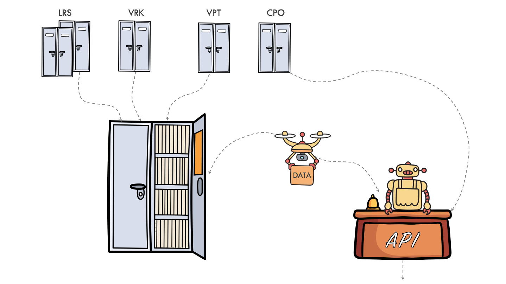

.. default-role:: literal

Duomenų valdymo vadovas
#######################

Šis išsamus duomenų teikimo ir atvėrimo vadovas skirtas:

- Valstybės įstaigoms, valdančioms Valstybės informacines sistemas ir teikiančioms jų
  duomenis kitoms valstybinėms įstaigoms;
- organizacijoms atveriančioms duomenis ir atvertų duomenų naudotojams

Dokumentacija sudaryta iš šių esminių dalių:

- Informacija **duomenų atvėrėjams** apie :ref:`duomenų atvėrimo <atvėrimas>`,
  atvertų duomenų :ref:`brandos lygio kėlimo <brandos-lygio-kėlimas>` ir
  :ref:`asmens duomenų tvarkymo <asmens-duomenys>` procesą.

- Informacija **duomenų teikėjams** apie :ref:`duomenų teikimo valstybinėms įstaigoms <duomenu_teikimas>`,
  ir duomenų :ref:`brandos lygio kėlimo <brandos-lygio-kėlimas>` procesus.

- Informacija **duomenų naudotojams**, apie tai, kaip :ref:`gauti duomenis iš valstybinių įstaigų <duomenu_gavimas>`,
  :ref:`gauti atvirus duomenis iš saugyklos <saugykla>`,
  ir kaip :ref:`teikti pageidavimus ir pastabas <poreikio-deklaravimas>` dėl duomenų.

- :ref:`Duomenų struktūros aprašo specifikacija <https://ivpk.github.io/dsa/draft/>`, kurioje rasite detalią
  informaciją apie tai kaip rašyti ir skaityti :term:`DSA` lenteles.

- Informacija diegėjams apie tai, kaip diegti ir konfigūruoti :ref:`priemones
  <priemonės>` skirtas darbui su duomenimis ir :term:`DSA` lentelėmis.

.. toctree::
    :caption: Vadovas
    :maxdepth: 3

    teikimas/teikimas
    atverimas
    poreikio-deklaravimas
    brandos-lygio-kelimas/index
    duomenu-saltiniai
    priemones

.. toctree::
    :caption: Priemonės
    :maxdepth: 3

    katalogas
    api/index
    spinta
    agentas

.. toctree::
    :caption: Žinynas
    :maxdepth: 3

    dsa/index
    savokos

- :ref:`Rodyklė <genindex>`
