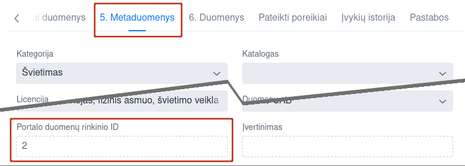
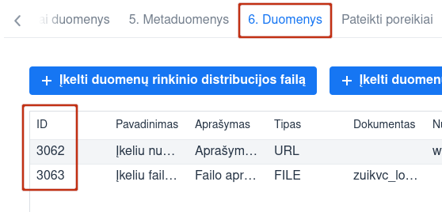

.. _katalogas:

#########
Katalogas
#########

Katalogas yra įrankis, skirtas duomenų valdytojams bei atvėrėjams įkelti ir
tvarkyti duomenų rinkinių aprašus, o duomenų gavėjams - juos peržiūrėti ir iniciuojti duomenų gavimą.

.. _terminai-ir-savokos:

Terminai ir sąvokos
*******************

„Laukas“
    Kabutėmis „“ žymimas duomenų įvedimo laukas, kur tarp kabučių rašomas lauko pavadinimas, matomas aprašomame lange.

„Tekstinis laukas“
    Vieta, kur sistemos naudotojas gali suvesti duomenis arba duomenys yra vaizduojami.

[Mygtukas]
    Dialogo lango arba lango mygtukai (taip pat vadinami komandiniais mygtukais) tekste yra žymimi kvadratiniais skliausteliais []. Tarp skliaustelių yra rašomas mygtuko pavadinimas. Sistemoje atvaizduoti kaip keturkampiai mygtukai ir aktyvios nuorodos (pabrauktas tekstas).

API (angl. Application Programming Interface)
    Programos valdymo sąsaja įgalina automatizuotai atlikti duomenų rinkinių kėlimą ir valdymą naudojant organizacijos programinę įrangą.

Lango mygtukas
    Mygtukas, kurio veiksmas įtakoja visus lango duomenis.

Įrašo mygtukas
    Mygtukas, kurio veiksmas įtakoja vieno įrašo duomenis.

IRS
    Rinkiniai iš Informacinių Rinkinių Sistemos (IRS)

„Meniu punktas”
    Kabutėmis „” yra žymimas meniu punktas. Tarp kabučių rašomas meniu punkto pavadinimas.

Žymimasis langelis
    Kvadrato formos figūra, kurios dešinėje rašomas tekstas. Aprašymas atspindi galimą veiksmą. Figūra parodo, ar yra pasirinkta nurodyta reikšmė, ar ne. Naudotojas gali keisti pasirinkimo langelio reikšmę pele pažymint arba panaikinant požymį langelyje.

Pagrindinis meniu
    Pagrindiniame meniu yra pristatomos pagrindinės sistemos funkcijos. Pagrindinio meniu punktai yra pasirenkami pelės kairiojo klavišo spustelėjimu pažymint juos.

Pasirinktas meniu punktas
    Norėdamas pasirinkti meniu punktą, sistemos naudotojas turi spragtelėti ant jo kairiu pelės klavišu.

Saugus slaptažodis
    Bent aštuonių simbolių ilgio; sudarytas iš raidžių, skaičių ir specialių simbolių (tokių kaip „@“, „#“ ar pan.).; skiriasi nuo ankstesnio.

VIISP
    Valstybės Informacinių Išteklių Sąveikumo Platforma, prieiname per Elektroninius Valdžios Vartus

El. Vartai
    Elektroninių valdžios vartų puslapis

Įstaiga
    Organizacija / institucija, vykdanti nustatytas veiklas

Informacinė sistema - Valstybinės įstaigos informacinė sistema, skirta teikti duomenis ar informacines paslaugas kitoms
    įstaigoms ar gyventojams.

Atvirų duomenų tvarkytojas
    Įstaigos atstovas, atsakingas už atvirų duomenų atvėrimą, jų aprašymą Kataloge,
    publikavimą į Saugyklą ar kitais būdais

Informacinės sistemos tvarkytojas
    Įstaigos atstovas, atsakingas už duomenų inventorizaciją, aprašymą Kataloge,
    paruošimą duomenų gavėjams, sutarčių su duomenų gavėjais derinimą.

|image2| Sąrašo rūšiavimas
    Sąrašą galima rikiuoti pagal bet kurį iš stulpelių: spauskite pasirinkto stulpelio pavadinimą arba |image2|.

.. _registracija-portale:

Registracija portale
*****************************

Šis skyrius persikėlė: :ref:`čia <katalogas-koordinatoriaus-registracija>`.

.. _prisijungimas-prie-sistemos:

Prisijungimas prie sistemos
===========================

1. Naršyklėje atidarykite puslapį https://data.gov.lt/login:

| |image15|
| *18 pav. Prisijungimo langas*

2. Įveskite **[El. paštas]** ir **[Slaptažodis]**;

3. Spauskite **[Prisijungti]**.

.. _pagrindinis-puslapis:

Pagrindinis puslapis
*****************

*Pagrindinis puslapis matomas prisijungus prie sistemos ir leidžia pasiekti aplinkos atributus:*

-  **Pagrindinis:** pirmasis puslapis rodomas po prisijungimo;

-  **Organizacijos:** organizacijų sąrašas;

-  **Duomenų ištekliai:** duomenų išteklių sąrašas;

-  **Panaudojimo atvejai:** panaudojimo atvejų sąrašas;

-  **Duomenų paieška:** duomenų paieškos puslapis;

-  **Prašymai atverti duomenis:** prašymų registracija, atvėrimo poreikių sąrašas [Meniu];

-  **Duomenų panaudojimo atvejai:** panaudojimo atvejų registracija, panaudojimo atvejų sąrašas [Meniu];

-  **Duomenų teikėjai:** duomenų teikėjų registravimas, duomenų teikėjų sąrašas [Meniu];

-  **Statistika:** statistikų ruošimo langas [Meniu];

-  *Kiti skyriai, reikalingi Koordinatorių arba Tvarkytojų darbui*.

.. _pagrindinis-naudotojo-meniu:

Pagrindinis naudotojo meniu
*****************

-  **Profilis:** jūsų profilio peržiūra;

-  **Užduotys:** jūsų užduotys;

-  **Planas:** organizacijos planų sąrašas;

-  **Mano organizacijos duomenų ištekliai:** organizacijos duomenų išteklių sąrašas;

-  **Mano poreikiai:** organizacijos poreikiai;

-  **Administravimas:** duomenų teikėjų registravimas, duomenų teikėjų sąrašas;

-  **Teikėjų prašymai:** kitų organizacijų prašymai dėl jūsų organizacijos duomenų;

-  **Atsijungti:** atsijungti iš paskyros;

| |image16|
| *19 pav. Pagrindinis naudotojo meniu*

\> **Išskleisti meniu:** Pelyte užveskite ant paskyros vardo ir pavardės.

\> **Suskleisti meniu:** Nuveskite pelytę nuo paskyros vardo ir pavardės.

.. _duomenu-istekliu-tvarkytojai-koordinatoriai:

Duomenų išteklių tvarkytojai / koordinatoriai
****************************

*Šis skyrius skirtas tik Koordinatoriams.*

1. Pagrindiniame meniu pasirinkite „Mano organizacijos duomenų ištekliai“:

| |tvarkytojai|
| *20 pav. Kelias iki tvarkytojų per organizacijos duomenų išteklius*

2. Pasirinkite „Tvarkytojai“:

| |meniu_istekliai|
| *21 pav. Organizacijos tvarkytojų pasirinkimas*

Pateksite į tvarkytojų administravimo puslapį:

| |tvarkytoju_kontrole|
| *22 pav. Tvarkytojų administravimo funkcionalumai*

Tvarkytojų peržiūros duomenys:

- **Vardas:** Paskyros naudotojo vardas ir pavardė.

- **El. paštas:** el. paštas, kuriuo registruotos paskyros. Galima filtruoti ir rikiuoti.

- **Telefonas:** Telefono numeris.

- **Rolė:** paskyrų naudotojų rolės. 

\> **Pridėti naują organizacijos koordinatorių / tvarkytoją:**

1. Spauskite **[Pridėti narį]**, užpildykite pridėjimo formą ir išsaugokite pakeitimus:

| |prideti_tvarkytoja|
| *23 pav. Tvarkytojų / koordinatorių pridėjimo forma*

====

\> **Redaguoti paskyras:**

1. Sąrašo eilutėje, kurioje yra norimas redaguoti tvarkytojas / koordinatorius spauskite **[Redaguoti]**:

| |tvarkytojo_redagavimas|
| *24 pav. Organizacijos tvarkytojo / koordinatoriaus redagavimo langas*

\> **Panaikinti paskyrą:**

- Sąraše pažymėkite paskyrą ir spauskite **[Pašalinti]**.

   *Atsidaro patvirtinimo langas*

| |tvarkytojo_naikinimas|
| *25 pav. Langas pašalinti pasirinktą organizacijos tvarkytoją / koordinatorių*

.. _organizacijos-rekvizitai:

Organizacijos rekvizitai
*************************

*Šis skyrius skirtas tik Koordinatoriams.*

\> **Redaguoti savo organizacijos duomenis:**

1. Pagrindiniame meniu pasirinkite **„Mano organizacijos duomenų ištekliai“**.

2. Spauskite **[Informacija]**.

2. Spauskite **[Redaguoti organizaciją]**.

*Pastaba: Šį veiksmą gali atlikti tik koordinatorius, organizacijos vardu prisijungęs per VIISP.*

| |organizacijos_informacija|
| *26 pav. Organizacijos redagavimo langas*

3. Organizacijos redagavimo lange redaguokite reikiamus duomenis.

4. Įsitikinę, kad tinkamai užpildėte/redagavote laukus, spauskite **[**\ |redaguoti_mygtukas|\ **]** lango apačioje.

| |redaguoti_org|
| *27 pav. Organizacijos redagavimo forma*

Redagavimo lange galima redaguoti laukus:

- **Registracijos numeris:** organizacijos registracijos numeris;

- **Pavadinimas:** pilnas organizacijos pavadinimas;

- **Kodinis pavadinimas:** kodinis organizacijos pavadinimas;

- **Tipas:** organizacijos tipas;

- **Valdymo sritis:** organizacijos valdymo sritis;

- **Paveiksliukas:** organizacijos paveiksliukas;

	* galima įkelti failą.

- **Tinklalapis:** organizacijos tinklalapis;

- **Elektroninis paštas:** kontaktinis organizacijos el. pašto adresas;

- **Telefono numeris:** kontaktinis organizacijos telefono numeris;

- **Adresas:** registruotas organizacijos adresas;

- **Duomenų atvėrimo paslaugų teikėjas:** pažymima, ar organizacija gali atverti duomenis;

- **Aprašymas:** aprašymas apie organizaciją;

====

.. _prasymai-gauti-duomenis:

Prašymai gauti duomenis
***********************

*Šis skyrius skirtas tik Koordinatoriams.*

*Portalo naudotojams pateikus arba vyr. koordinatoriui priskyrus poreikį Jūsų organizacijai, gausite pranešimą apie naują poreikį į Jūsų paskyrai užregistruotą el. paštą.*

.. _poreikiu-saraso-perziura:

Poreikių sąrašo peržiūra
========================

1. Pagrindiniame menu pasirinkite **„Atvėrimo poreikiai“**.

| |image37|
| *28 pav. Poreikių sąrašo langas*

Bendrame organizacijai pateiktų duomenų atvėrimo poreikių sąraše – pagrindinė poreikių informacija:

- **Būsena:** organizacijai pateikto poreikio atvėrimo būsena. Galimos reikšmės:

   -  „Pateiktas“, jei organizacijos vardu dar nebuvo atsakyta į poreikį;

   -  „Planuojama atverti“, jei poreikis patvirtintas;

   -  „Nenumatytas atverti“, jei poreikis atmestas;

- **Organizacija:** kuriai pateiktas duomenų atvėrimo poreikis;

- **Pavadinimas:** duomenų rinkinio, kuriam pateiktas poreikis atverti, pavadinimas;

- **Aprašymas:** trumpas duomenų rinkinio, kuriam pateiktas poreikis atverti, aprašymas;

- **Duomenų rinkinio ID:** duomenų rinkinio unikalus identifikatorius sistemoje.

   *Pateikiamas, jei poreikis skirtas jau atvertą rinkinį atnaujinti*;

- **Formatas:** pageidaujamas duomenų pateikimo formatas;

- **Sukurtas:** Data ir laikas, kada poreikis buvo sukurtas viešame Portale;

- **Komentaras:** koordinatoriaus/ tvarkytojo atsakymas su atvėrimo poreikio priežastimi.

*Įsijungus puslapį, sąrašas pateikiamas automatiškai surikiuotas pagal sukūrimo datą, pateikiant naujausios datos poreikius viršuje.*

.. _atverimo-poreikoi-perziura:

Atvėrimo poreikio peržiūra
==========================

*Su sąraše pateiktais poreikiais galite:*

- *Peržiūrėti išsamesnę informaciją;*

- *Redaguoti kai kuriuos poreikių duomenis;*

- *Atsakyti į poreikį.*

\> **Peržiūrėti išsamesnę pateikto poreikio informaciją:**

1. Sąraše pasirinkite poreikį ir du kartus paspauskite ant poreikio.

2. Atverto lango viršuje pateiktas meniu, kuriuo naudojantis pasiekiamos atvėrimo poreikio skiltys. Melsvai paryškinta ta skiltis, kurioje tuo metu esate. Numatytoji atidaryti skiltis yra **„Įrašo informacija“**:

| |image38|\ |image39|
| *29 pav. Atvėrimo poreikio lango meniu*

Šiame lange pateikta pagrindinė poreikio informacija, pateikta poreikio teikėjo:

- **Autorius**: poreikio teikėjo vardas, pavardė ir el. paštas;

- **Registravimo data**: data ir laikas, kada poreikis buvo pateiktas;

- **Norimas atlikti pakeitimas:** įvardinama, koks konkrečiai pakeitimas turėtų būti įvykdytas esamam duomenų rinkiniui. Poreikio teikėjas gali pasirinkti nuo vieno iki trijų pakeitimų iš pateikto sąrašo;

- **Pasiūlymas organizacijai:** poreikio teikėjas gali pateikti pasiūlymą organizacijai;

- **Duomenų atnaujinimo periodiškumas:** nurodomas periodas, kas kiek laiko turi būti atnaujinti rinkinyje pateikti duomenys;

- **Patinka paspaudimai:** neredaguotinas laukas, kuriame nurodyta, kiek viešos aplinkos naudotojų paspaudė „Patinka“ prie poreikio. Į „Patinka“ paspaudimų skaičių atsižvelgiama vertinant poreikio prioritetą;

- **Norimas keisti duomenų rinkinys:** pavadinimas jau esamo duomenų rinkinio, kuriam atnaujinti teikiamas poreikis;

- **Aprašymas:** duomenų rinkinio ir poreikio aprašymas. Pildo *poreikio teikėjas*;

- **Formatas:** kokias formatais atveriamas duomenų rinkinys. Laukas neredaguotinas. Pildo *poreikio teikėjas*;

- **Papildoma informacija:** papildoma informacija apie duomenų rinkinį ar poreikį. Pildo *poreikio teikėjas*.

\> **Peržiūrėti poreikio teikėjo pateiktą struktūrą:**

1. Pagrindiniame meniu pasirinkite **„Atvėrimo poreikiai“;** du kartus
   paspauskite ant pasirinkto poreikio ir atsidarytų papildomas meniu „Atvėrim
   poreikis“, pasirinkite „\ **Pageidaujama duomenų struktūra**\ “:

   | |image40|
   | *30 pav. Pageidaujamos duomenų rinkinio struktūros fragmentas*

2. Pageidaujama duomenų struktūra aprašoma šiuose laukuose
   (\*: privalomi laukai):

   - **Duomenų pavadinimas \* :** Lauko, kuriame pateikiamas tam tikro tipo
     duomuo, pavadinimas;

   - **Duomenų pavadinimas standartiniame žodyne:** duomens pavadinimas,
     atitinkantis lietuvių kalbos taisykles.

   - **Duomenų tipas \* :** duomenų tipas, įrašomas anglų kalba.

   - **Pastabos:** laisvai įvedamos pastabos apie duomenis.

3. Duomenų teikėjas duomenų rinkinio struktūrą gali įkelti kaip Excel failą: atveju lango viršuje patiekiama nuoroda parsisiųsti failą.

   | |struk|
   | *31 pav. Reikiamos duomenų struktūros failo atsisiuntimo nuoroda poreikio lange*

   *SVARBU: pakeisti pageidaujamą duomenų struktūrą gali tik poreikio teikėjas.*

\> **Peržiūrėti atvėrimo poreikio būsenų pasikeitimus:**

1. Pagrindiniame meniu pasirinkite **„Atvėrimo poreikiai“;** du kartus
   paspauskite ant pasirinkto poreikio, kad atsidarytų papildomas meniu
   „Atvėrimo poreikis“, kur pasirinkite „\ **Būsenų istorija**\ “.

  | |poreikist|
  | *32 pav. Atvėrimo poreikio lango skiltis „Būsenų istorija“*

2. Sąraše atvaizduojami duomenys:

   - **Sukurtas:** Data ir laikas, kada buvo atliktas veiksmas

   - **Būsena:** Veiksmo, kuris buvo atliktas, pavadinimas. Galimos reikšmės

     -  „Sukurtas“
     -  „Redaguotas“
     -  „Patvirtintas“
     -  „Atmestas“.

   - **Autorius:** paskyros savininko, atlikusio veiksmus, vardas ir pavardė.

   - **Komentaras:** Komentaras, kuris gali būti paliekamas atsakant į poreikį.

.. _atsakymas-i-pateikta-atverimo-poreiki:

Atsakymas į pateiktą atvėrimo poreikį
=====================================

1. Pagrindiniame meniu pasirinkite **„Atvėrimo poreikiai“;** du kartus
   paspauskite ant pasirinkto poreikio, kad atsidarytų papildomas meniu
   „Atvėrimo poreikis“, kur pasirinkite „\ **Organizacijos atsakymas**\ “.

   | |poreik|
   | *33 pav. Atvėrimo poreikio lango skilties „Organizacijos atsakymas“ pavyzdys*

2. Užpildykite atsakymo formos laukus:

   - Pasirinkite atsakymą pažymint vieną iš atsakymo laukų:

     - „Planuojamas atverti“, jei poreikis priimamas ir rinkinys planuojamas
       atverti.

     - „Nenumatytas atverti“, jei tuo metu duomenų rinkinys nenumatytas atverti.

   - Jei rinkinys planuojamas atverti, lauke **„Planuojama atvėrimo data“**
     įveskite numatytą rinkinio atvėrimo datą formatu „mm/dd/mmmm“ arba
     pasirinkę kalendoriuje, spausdami **[**\ |image41|\ **]** dešinėje.

   - Tekstiniame lauke **„Komentaras dėl atvėrimo numatymo arba atmetimo“**
     įrašykite komentarą dėl atsakymo. Ši informacija bus pateikta viešame
     portale bei matoma atvėrimo poreikių sąrašo lange.

   - Tekstiniame lauke **„Galutinis organizacijos atsakymas“** įrašykite
     atsakymą dėl atvėrimo ir priežastį. Ši informacija bus pateikta poreikio
     teikėjui.

Spauskite mygtuką **[Saugoti]**, norėdami išsaugoti atsakymą: atsakymas
į poreikį ir jo priežastis bus automatiškai nusiųsta poreikio teikėjui.

Poreikio patvirtinimo būsena po atsakymo gali būti pakeista pagal poreikį.

.. _duomenu-rinkiniai:

Duomenų rinkiniai
*****************

Duomenys į Portalą keliami dviem būdais:

1. Kuriant naują duomenų rinkinį;

   Plačiau: \ `Naujo duomenų rinkinio sukūrimas ir inventorinimas <#naujo-duomenu-rinkinio>`__;
2. Importuoti pagal šabloną užpildytą Excel failą;

   Plačiau: \ `Duomenų šablono atsisiuntimas <#duomenų-šablono-atsisiuntimas>`__.

\> **Importavus duomenų rinkinį:**

1. Koreguokite informaciją.

   Plačiau: \ `Duomenų distribucijos tvarkymas <#_Duomenų_distribucijos_tvarkymas>`__\;

2. Pereikite prie veiksmų su rinkiniu.

   Plačiau: `Duomenų rinkinio struktūros sukūrimas <#_Duomenų_rinkinio_struktūros>`__.

\> **Išsaugoti įvestą informaciją:**

1. Atitinkamoje kortelėje spauskite **[Saugoti]**.

\> **Atšaukti įvestų pakeitimų saugojimą:**

1. Jei pakeitimų atsisakote, spauskite **[Grįžti į sąrašą]**.

.. _duomenu-istekliu-saraso-perziura:

Duomenų išteklių sąrašo peržiūra
================================

*Organizacijos pačios kuria ir pildo joms priklausančius duomenų išteklius.*

*Jei duomenų išteklius perkeliamas iš vienos organizacijos kitai, pirmoji netenka prieigos prie jo.*

*Išteklių sąrašą galima peržiūrėti dviem būdais - visų organizacijų ir savo organizacijos (einant per savo organizacijos išteklius bus matomi tik ištekliai, priklausantys savo organizacijai, taip pat bus galima pridėti duomenų išteklių)*

.. _savo-organizacijos-duomenu-istekliu-saraso-perziura:

Savo organizacijos duomenų išteklių sąrašo peržiūra
================================

*Duomenų išteklių sąrašo lange galite:*

- *kurti naujus duomenų išteklius (tik peržiūrint savo organizacijos duomenų išteklius);*

- *rikiuoti duomenų išteklius;*

- *filtruoti duomenų išteklius;*

- *peržiūrėti sukurtų duomenų išteklių informaciją.*

1.a. Pagrindiniame meniu spauskite **[Mano organizacijos duomenų ištekliai]** (savo organizacijos duomenų ištekliams peržiūrėti)

1.b. Pagrindiniame puslapyje spauskite **[Duomenų ištekliai]** (einant per pagrindinį puslapį)

2. Sąraše pateikiama pagrindinė duomenų išteklių informacija:

- **Pavadinimas:** duomenų ištekliaus pavadinimas;

- **Sukurta**: duomenų ištekliaus sukūrimo data;

- **Organizacija:** organizacija, tvarkanti duomenų išteklių;

- **Duomenų išteklius viešinamas:** duomenų ištekliaus vaizdavimo viešoje aplinkoje būsena;

- **Duomenų ištekliaus tipas**;

- **Peržiūros:** piktograma **[**\ |perziuros|\ **]**, vaizduojanti kiek peržiūrų sulaukė duomenų išteklius;

- **„Patinka“:** piktograma **[**\ |patinka|\ **]**, vaizduojanti kiek paspaudimų „Patinka“ sulaukė duomenų išteklius;

- **Parsisiuntimo mygtukas:** piktogtama **[**\ |parsisiusti|\ **]**, vaizduojanti kiek kartų duomenų išteklius buvo parsisiųstas;

====

\> **Filtruoti duomenų išteklių sąrašą:**

1. Įveskite lauko vertę arba jo fragmentą į paieškos langą;

====

\> **Rikiuoti sąrašą:**

1. Nuveskite pelytę ant **Naujausi:**. Pamatysite rikiavimo pasirinkimus.

| |rikiavimas|
| *34 pav. Duomenų išteklių rikiavimas

2. Pasirinkite rikiavimo būdą.

====

.. _duomenu-sablono-atsisiuntimas:

Duomenų šablono atsisiuntimas
=============================

*Duomenų rinkinys, įkeliamas kaip failas, privalo atitikti šabloną.*

1. Pagrindiniame meniu spauskite **[Duomenų rinkiniai]**.

2. Duomenų rinkinių lange spauskite mygtuką **[**\ `Atsisiųsti XLSX šabloną
   <https://data.gov.lt/opening/learningmaterial/14>`__\ **]**.

3. Į kompiuterį taip parsisiųsite Excel failą.

4. Pagal gautą šabloną sudarykite (arba užpildykite gautą) duomenų failą, kurį galėsite įkelti į ADP.

.. _duomenu-rinkinio-importavimas:

Duomenų rinkinio importavimas
=============================

1. Pagrindiniame meniu pasirinkite **„Duomenų rinkiniai“**;

2. Duomenų rinkinių sąrašo lange paspauskite **[Importuoti XLSX]**;

	*Importuojant XLSX failą, įkeliamas tik aprašas.*
	*Inventorinimo, prioritetų, finansiniai ir meta- duomenys nėra įkeliami.*
	*Rinkinio metaduomenys įkeliami atskirai, po aprašymo failo įkėlimo.*

3. Įkelkite failą iš kompiuterio sekdami įkėlimo lango nuorodas.

.. _vaikiniai-duomenu-istekliai-sarysiai:

Vaikiniai duomenų ištekliai (sąryšiai)
======================================

Kiekvienas duomenų rinkinys gali, bet neprivalo turėti hierarchinius ryšius su kitais duomenų rinkiniais ar ištekliais
(turėti tėvinį išteklį arba/ir vaikinių išteklių) apribotus iki 10 lygių gylio. Saryšį galima nustatyti kuriant naują
išteklių. Pamatyti visus vaikinius išteklius galima per skirtuką "Ištekliai", esantį duomenų rinkinio/išteklio formoje.

*Duomenų išteklius galima susieti dviem būdais.*

*Norint susieti du registruotus duomenų išteklius, reikalinga atlikti šiuos žingsnius:*

1. Pasirinkite išteklių iš savo organizacijos duomenų išteklių sąrašo;

2. Pasirinkite **„Susieti su duomenų ištekliumi“**:

| |susieti_isteklius|
| *35 pav. Išteklių sąryšio sukūrimo mygtukas*

3. Užpildykite susiejimo formos laukus (priklausomai nuo ištekliaus tipo, galimos sąsajos skirsis) ir spauskite **[Pridėti]**:

| |susieti_isteklius_pvz|
| *36 pav. Informacinės sistemos susiejimo su duomenų rinkiniu forma*

*Norint susieti duomenų išteklius sukuriant naują duomenų išteklių, reikalinga atlikti šiuos žingsnius:*

1. Pasirinkti išteklių iš savo organizacijos duomenų išteklių sąrašo;

2. Paspauskite kortelę **[Ištekliai]**:

| |istekliai_kortele|
| *37 pav. Kortelė „Ištekliai“*

3. Paspauskite **[Pridėti vaikinį duomenų išteklių]**:

| |prideti_vaikini_istekliu|
| *38 pav. Mygtukas „Pridėti vaikinį duomenų išteklių“*

4. Būsite nukreipti į naujo duomenų ištekliaus kūrimo puslapį. Sukūrus išteklių jis bus priskirtas kaip vaikinis išteklius.

.. _irs-rinkiniai:

IRS rinkiniai
=============

| |image75|
| *39 pav. IRS rinkinių sąrašo lango tvarkytojams fragmentas*

IRS rinkinių sąraše galima peržiūrėti tokią bendrą informaciją:

- **Eil. nr.:** rinkinio numeris sąraše, sugeneruotas portale automatiškai;

- **ID:** unikalus rinkinio identifikatorius sistemoje, sugeneruotas automatiškai importuojant rinkinį.

	*Galima filtruoti (skaitinis);*

- **Viešas:** rinkinio viešumo portalo viešoje aplinkoje būsena. Laukas žymimas varnele **[**\ |image76|\ **]**, jei rinkinys – viešas;

- **Pavadinimas:** pilnas duomenų rinkinio pavadinimas.

	*Galima filtruoti (tekstinis);*

- **Tvarkytojas:** Organizacijos tvarkytojo, atsakingo už rinkinį, vardas ir pavardė.

	*Galima filtruoti (tekstinis);*
	
	*Gali būti tuščias;*

- **Atnaujintas:** data ir laikas, kada rinkinys buvo paskutinį kartą atnaujintas.

====

\> **Redaguoti IRS rinkinį:**

1. Paspauskite ant IRS rinkinio, kurį norite peržiūrėti/ tikslinti/ sutvarkyti eilutės:

| |image77|
| *40 pav. IRS rinkinių sąrašo langas*

*SVARBU: IRS rinkinį reikia pašalinti, jeigu duomenų rinkinys nebėra aktualus, arba jau yra įvesta naujas panašus duomenų rinkinys. IRS rinkinius galima redaguoti. Tikslinant IRS rinkinius galioja tos pačios taisyklės, kaip ir naujo duomenų rinkinio įvedimo atveju.*

*Tikslinant IRS rinkinius rekomenduotina pakeisti „5. Metaduomenų“ lauko „Katalogas“ informaciją: iš „Duomenys iš IRS“ į „Lietuvos“. Atlikus šį pakeitimą duomenų rinkinys bus matomas tik bendrame „Duomenų rinkiniai“ sąraše, o „IRS rinkiniai“ sąraše šio duomenų rinkinio nebus.*

*Sąrašas pildomas automatiškai, importuojant rinkinius iš atitinkamų portalų.*

.. _duomenu-istekliai:

Duomenų ištekliai
*****************

Duomenų ištekliai kuriami dviem žingsniais: duomenų ištekliaus rūšies pasirinkimu ir duomenų ištekliaus įvedimu.

Duomenų ištekliaus rūšies forma

1. Meniu lange pasirinkite punktą **[Mano organizacijos ištekliai]**.

| |meniu|
| *41 pav. Mano organizacijos ištekliai*

2. Duomenų išteklių sąrašo lange spauskite **[+ Pridėti duomenų išteklių]**.

    *Paspaudus mygtuką pridėti duomenų išteklių, atidaroma „Duomenų ištekliaus rūšies forma“.*

    | |image123|

    | *116 pav. Duomenų ištekliaus rūšies forma

3. Pasirinkite norimą duomenų ištekliaus rūšį.

4. Įsitikinkite, kad įvedėte teisingus duomenis ir spauskite **[Toliau]**.

5. Paspaudus **[Toliau]**, bus atidaryta „Duomenų ištekliaus forma“.

    | |image124|
    | *Duomenų ištekliaus forma, duomenų ištekliaus rūšį pasirinkus „Duomenų rinkinys“

6. Užpildykite formą.

    **Pastaba:** priklausomai nuo pasirinktos duomenų ištekliaus rūšies, šios formos laukai gali skirtis.

7. Įsitikinkite, kad įvedėte teisingus duomenis ir spauskite **[Sukurti]**.

.. _panaudojimo-atvejai:

Panaudojimo atvejai
===================

| |duomenu_isteklio_panaudojimo_atvejai|
| Duomenų ištekliaus panaudojimo atvejų sąrašas

Čia matomi visi* panaudojimo atvejai, kurie gauna duomenis iš šio ištekliaus.
Mygtukas [*Pridėti panaudojimo atvejį*] matomas tik tuo atveju, jeigu turite panaudojimo atvejų, į kurį turite teisę įtraukti šį išteklių.
Pašalinti galite tik tuos atvejus, kurie neturi sugeneruotų sutarčių.
Plačiau :ref:`panaudojimo_atvejo_istekliai`

*- Kuriuos turite teisę peržiūrėti. Apie teises skaitykite čia :ref:`panaudojimo_atvejo_perziura`

.. _duomenu-rinkinio-forma:

Duomenų rinkinio forma
**********************

1. Užpildykite kortelę (\*: privalomi laukai):

   - **Duomenų išteklius viešinamas**;

	 *Numatytas teigiamas pasirinkimas;*

   | |ar_viesinamas|
   | *44 pav. Formos fragmentas - duomenų ištekliaus viešinimo pasirinkimas.*

   - **Pavadinimas*:** pateikiamas pilnas duomenų rinkinio pavadinimas.;

   | |rink_pavadinimas|
   | *45 pav. Formos fragmentas - duomenų ištekliaus pavadinimas.*

   - **Kodinis pavadinimas:** duomenų ištekliaus identifikatorius.;

   | |rink_kodinis_pavadinimas|
   | *46 pav. Formos fragmentas - duomenų ištekliaus kodinis pavadinimas.*

   - **Aprašymas*:** pilnas duomenų rinkinio aprašymas;

   | |rink_aprasymas|
   | *47 pav. Formos fragmentas - duomenų ištekliaus aprašymas.*

   - **Dokumentacija:** dokumentai apie duomenų išteklių;

   | |dok_failai|
   | *48 pav. Formos fragmentas - dokumentai apie duomenų išteklių.*

   - **Dokumentacija:** puslapiai apie duomenų išteklių;

   | |dok_nuoroda|
   | *49 pav. Formos fragmentas - puslapis apie duomenų išteklių.*

   - **Žymės:** iš sąrašo pasirenkami raktažodžiai arba žymos;

   | |rink_zymes|
   | *50 pav. Formos fragmentas - žymės.*

   - **Prieigos nuoroda:** tinklalapis, kuriame galima susipažinti su duomenų ištekliu, jo pateiktimi ir (arba) papildoma informacija;

   | |rink_prieigos_nuoroda|
   | *51 pav. Formos fragmentas - prieigos nuoroda.*

   - **Katalogas:** katalogas, kurio turinys domina šio katalogo kontekste;

   | |rink_katalogas|
   | *52 pav. Formos fragmentas - katalogas.*

   - **Atnaujinimo dažnumas*:** duomenų atnaujinimo dažnumas;

   | |rink_atnaujinimo_daznumas|
   | *53 pav. Formos fragmentas - atnaujinimo dažnumas.*

   - **Prieigos teisės*:** atviri, apsaugoti ar uždari duomenys;

   | |rink_prieigos_teises|
   | *54 pav. Formos fragmentas - prieigos teisės.*

   - **Kontaktinis asmuo ar organizacija:** skirta pastabų siuntimui;

   | |rink_kontaktinis_asmuo|
   | *55 pav. Formos fragmentas - kontaktinis asmuo ar organizacija.*

   - **Tėvinis išteklius:* pasirenkamas išteklius, kuris gali būti duomenų rinkinio tėvinis išteklius;

   | |rink_tevinis|
   | *56 pav. Formos fragmentas - tėvinis išteklius.*

   - **Teisės - Aprašymas:** - Teisių deklaracijų aprašymas.

   | |teises_aprasymas|
   | *57 pav. Formos fragmentas - teisės - aprašymas.*

   - **Teisės - Susijęs dokumentas:** - Teisių deklaracijos nuoroda.

   | |susijes_dok|
   | *58 pav. Formos fragmentas - teisės - susijęs dokumentas.*

4. Įsitikinkite, kad įvedėte teisingus duomenis ir spauskite **[Sukurti]**.

   | |34pav|
   | *59 pav. Sėkmingai išsaugotos duomenų rinkinio formos pranešimas.*

.. _struktura:

Struktūra
=========

*Duomenų naudotojams bus aiškiau, kaip publikuojami duomenys, jei įkelsite ir struktūrą:*

| |image47|
| *60 pav. Struktūros failo Excel dokumente pavyzdys*

*SVARBU: Į Portalą vienam rinkiniui turi būti įkeliamas vienas duomenų struktūros aprašas (DSA).*

*Galima įkelti kelias vieno rinkinio versijas, tačiau vienam rinkiniui gali būti publikuojamas tik vienas DSA.*

1. Duomenų rinkinio lange spauskite kortelę **„Struktūra“**.

   | |struktura|
   | *61 pav. Struktūros kortelė*

2. Duomenų rinkinio struktūros lange matomi funkcionalumai:

- **Eksportuoti**: parsisiųsti DSA;

- **Importuoti**: importuoti DSA;

- **Naujas modelis**: kurti modelį;

- **Nauja versija:** kurti naują modelio versiją;

Duomenų ištekliaus struktūros lange pateikiama pagrindinė informacija:

- **Pridėtas**: data ir laikas, kada struktūros failas buvo pridėtas;

- **Pavadinimas**: struktūros pavadinimas sistemoje, sukuriamas įkeliant struktūros failą;

- **Failo pavadinimas**: pilnas įkelto struktūros failo pavadinimas;

- **Standartinis:** požymis, kad duomenų rinkinys yra bendrinės struktūros;

- **Aktualus:** požymis, kad duomenų rinkinys yra naujausios versijos.

1. Pasirinkite reikiamą duomenų struktūros versiją ir spauskite [Padaryti aktualiu].

   *Sėkmingai atlikus veiksmą, sistema pažymės struktūrą stulpelyje „Aktualus“ su verte „Taip“.*

*Jeigu nesate įkėlę duomenų struktūros, gausite klaidos pranešimą:*

| |image49|
| *62 pav. „Daryti aktualiu“ klaidos langas, kai nepateikta duomenų struktūra*

2. Pasirinkite norimą pašalinti duomenų struktūros versiją ir spauskite **[Šalinti failą]**.

   *Sėkmingai atlikus veiksmą, sistema pašalins pasirinktą struktūrą iš sąrašo.*

| |image50|
| *63 pav. „Šalinti failą“ patvirtinimo pranešimas*

.. _metaduomenys:

Metaduomenys
============

*Rinkinys jau turi būti suinventorintas, turėti įvestus prioritetus ir finansinius duomenis.*

1. Spauskite **[5. Metaduomenys]**.

| |image56|
| *67 pav. Duomenų rinkinio metaduomenų įvedimo/redagavimo lango pirmas fragmentas*

| |image57|
| *68 pav. Duomenų rinkinio metaduomenų įvedimo/redagavimo lango antras fragmentas*

2. Užpildykite laukus pagal poreikį (\* – privalomi; A – automatiniai):

- **Kategorija*:** iš sąrašo pasirenkama, kokiai kategorijai priklauso duomenų rinkinys;

- **Licencija:** iš sąrašo pasirenkama duomenų rinkiniui taikoma licencija.

   *Pasirinkus kurią nors licenciją, pateikiama nuoroda į ją, kad galėtumėte patikrinti, ar pasirinkta licencija tinkama;*

- **AD koordinatorius (A):** iš sąrašo pasirenkamas organizacijos koordinatorius;

- **Sukurtas (A):** data ir laikas, kada duomenų rinkinys buvo sukurtas;

- **Duomenų šaltinis (A):** duomenų rinkinio distribucijos šaltinio failo pavadinimas;

- **Prieigos teisės:** lauke įvardinama, kas turi prieigos teises prie duomenų rinkinio, jei prieiga yra ribota;

- **Periodo pradžia (A):** rinkinyje pateiktų duomenų periodo pradžia.

   *Laukas netaisomas: nustatomas automatiškai, nurodant anksčiausią visuose įkeltuose rinkinio failuose periodo pradžios datą (nurodoma keliant duomenų failą).*

   *Neįkėlus nei vieno duomenų failo, laukas rodomas tuščias; nustatoma automatiškai.*

   *Jei nežinoma, rašoma reikšmė „Nežinoma“*;

- **Raktiniai žodžiai*:** suvedami raktiniai žodžiai, tinkami duomenų rinkiniui, naudojami Portalo naudotojų viešoje aplinkoje atliekant išplėstinę paiešką. Visus raktinius žodžius rašykite mažosiomis raidėmis, tarpusavyje atskirkite kableliais. Rekomenduojama nurodyti iki 6 raktinių žodžių;

- **Įvertinimas:** viešoje aplinkoje registruotų naudotojų pateiktas bendras rinkinio įvertinimas 5 balų skalėje;

- **Kalba:** iš sąrašo pasirenkama kalba, kuria bus atveriamas duomenų rinkinys. *Kalbų skaičius neribojamas*;

- **Katalogas:** iš sąrašo pasirinkite „Lietuva“;

- **Duomenų atnaujinimo periodiškumas:** iš sąrašo pasirenkama, kokiu dažnumu atnaujinami rinkinio duomenys;

- **AD Tvarkytojas*:** iš sąrašo pasirenkamas organizacijos AD tvarkytojas.

   *Laukas užpildomas automatiškai, tačiau gali būti redaguotas;*

- **Atnaujintas (A):** paskutinio rinkinio atnaujinimo data ir laikas;

- **Vidinis ID:** rinkinio identifikatorius Portalo sistemoje;

- **Formatas (A):** formatas(-ai), kuriuo(-iais) atveriamas rinkinys;

- **Periodo pabaiga:** rinkinyje jau pateiktų duomenų periodo pabaiga.

   *Nustatoma automatiškai, priklausomai nuo to, kokia vėliausia periodo pabaiga nurodyta įkeltuose failuose.*

   *Neįkėlus nei vieno duomenų failo, laukas rodomas tuščias;*

- **Portalo duomenų rinkinio ID (A):** duomenų rinkinio unikalus identifikatorius sistemoje;

- **Atvirumas:** duomenų rinkinio atvirumo lygis skalėje nuo 1 iki 5.

- **Platinimo sąlygos:** įvedamos sąlygos platinti duomenų rinkinį.

   Lango apačioje pateikta prioriteto balų suma.

| |image58|
| *69 pav. Duomenų rinkinio metaduomenų įvedimo/redagavimo lango apatinis fragmentas*

3. Užpildžius reikiamus laukus, galite spauskite mygtuką **[Saugoti]** arba pereikite prie kitų kortelių pildymo.

   *Išsaugojus rinkinio būsena bus pakeista į*\ **„Užpildyti metaduomenys“**.

*Jei spaudžiate*\ **[Saugoti]**\ *neužpildę kai kurių privalomų laukų, net jei jie buvo neužpildyti ir išsaugoti prieš Jums atsidarant metaduomenų langą, sistema parodys papildomą langą, kuriame pateikiami privalomi neužpildyti DCAT laukai.*

*Paaiškinimo lange galite tik įvesti lauko neužpildymo priežastį. Jei norite lauką užpildyti, paaiškinimo lange spauskite*\ **[Atšaukti]**\ *ir grįšite prie pildymo.*

4. Tekstiniuose laukuose įveskite priežastį kiekvienam DCAT laukui, kurio neužpildėte.

| |48pav|
| *70 pav. Duomenų rinkinio metaduomenų neužpildymo paaiškinimo lango pavyzdys*

*Nurodyta priežastis bus matoma poreikio peržiūros lango skiltyje*\ **„Įvykių istorija“**\ *, komentaro lauke.*

| |image60|
| *71 pav. DCAT lauko neužpildymo priežasties peržiūros pavyzdys*

5. Įvedę priežastis neužpildyti privalomiems laukams, spauskite **[Saugoti]**.

6. Spauskite **[Saugoti]** metaduomenų įvedimo lange, kad išsaugotumėte įvestus duomenis arba pakeitimus.

.. _distribucijos:

Distribucijos
=============

Rinkinio duomenys gali būti įkeliami, kai įkeltas duomenų struktūros
aprašas **„2. Struktūra“**

1. Duomenų rinkinio lango meniu spauskite **[6. Duomenys]**.

2. Sistema parodys duomenų įkėlimui skirtą langą.

| |image61|
| *72 pav. Duomenų rinkinio duomenų distribucijos langas*

*SVARBU: jeigu nėra sukurta aktualios duomenų struktūros, vartotojui nebus
leidžiama įkelti duomenis ir bus rodomas atitinkamas pranešimo langas:*

| |image62|
| *73 pav. Duomenų rinkinio duomenų distribucijos lango klaidos pranešimas*

Lange pateiktas sąrašas įkeltų nuorodų ir failų, kuriuose pateikti duomenys,
nurodant šią informaciją:

- **ID:** unikalus failo arba nuorodos ID sistemoje, sugeneruojamas
  automatiškai įkeliant;

- **Pavadinimas:** failo arba nuorodos pavadinimas sistemoje;

- **Aprašymas:** trumpas failo arba nuorodos aprašymas;

- **Tipas:** nurodoma „FILE“, jei tai yra failas, arba „URL“, jei tai nuoroda;

- **Dokumentas:** įkelto failo pilnas pavadinimas. *Jei tai nuoroda, laukas
  paliekamas tuščias*;

- **Nuoroda:** įkelta pilna nuoroda (su pradžia `http://` arba `https://`). *Jei
  tai failas, laukas paliekamas tuščias*;

- **Versija:** skaičiumi nurodoma, kelinta tai įkelta to failo arba nuorodos
  versija;

- **Įkelta:** data ir laikas, kada nuoroda arba failas buvo įkeltas;

- **Atnaujinta:** data ir laikas, kada nuoroda arba failas buvo paskutinį kartą
  atnaujintas.

3. Įkelkite naują distribuciją:

- kaip *failą*: spauskite **[+Įkelti duomenų rinkinio distribucijos failą]**.

- kaip *nuorodą*: spauskite **[+Įkelti duomenų distribucijos nuorodą]**.

   *Sistema parodys naujos distribucijos langą.*

| |image63|
| *74 pav. Naujos distribucijos kaip failo įkėlimo langas*

4. Užpildykite reikiamus laukus ( \* - privalomi):

- **Pavadinimas \* :** Įkeliamo duomenų failo pavadinimas;

- **Savivaldybė:** Savivaldybė, kuriai priklauso įkeliamas duomenų rinkinio failas;

- **Laikotarpio pradžia \* :** Įkeliamo failo laikotarpio pradžia;

- **Aprašymas \* :** Įkeliamo duomenų failo aprašymas;

- **Regionas:** Regionas, kuriam priklauso įkeliamas failas;

- **Laikotarpio pabaiga \* :** Įkeliamo failo laikotarpio pabaiga.

   *Failo įkėlimas privalomas pridedant distribuciją.*

5. Spauskite mygtuką **[Upload files]** arba nutempkite failą iki lauko **{Drop files here}**.

6. Jei distribuciją keliate kaip nuorodą, nuorodos įkėlimo lange vietoje suveskite papildomus privalomus laukus:

.. _note-dist-url-type:

- **Formatas*:**\ * iš sąrašo pasirinkite vieną duomenų distribucijos formatą;*
- **Nuoroda*:**\ * tiesioginė nuoroda į duomenų failą, kurį galima atsisiųsti.*

.. note::

    Jei pateikiate nuorodą, ne tiesiogiai į duomenų failą, o į svetainę,
    kurioje publikuojami duomenys, tuomet **Formatas:** laukelyje pasirinkite
    **URL**, kuris žymi, kad ši nuoroda yra ne į duomenis, o į svetainę iš
    kurios galima atsisiųsti duomenis.

| |image64|
| *75 pav. Distribucijos nuorodos įkėlimo langas*

7. Užpildę laukus, spauskite **[Saugoti]**.

*Naujai įkeltas failas ar nuoroda bus iškart matomi distribucijų lange esančiame sąraše:*

| |image61|
| *76 pav. Duomenų distribucijų sąrašo pavyzdys*

====

\> **Redaguoti distribuciją:**

- Įkeltų distribuciją atnaujinimai atliekami per API ir UI.

\> **Pašalinti distribuciją iš sąrašo:**

- pažymėkite ją sąraše ir spauskite **[Šalinti distribuciją]** ekrano viršuje.

====

.. _distribucijos_prasymai-gauti-duomenis:

Prašymai gauti duomenis
=======================

1. Ištekliaus peržiūros lango meniu pasirinkite skiltį **„Poreikiai“**.

| |poreikiai|
| *77 pav. Duomenų rinkiniui pateiktų poreikių peržiūros langas*

Poreikių peržiūros lange galite tik peržiūrėti pateiktų poreikių informaciją:

- **Pateiktas:** data ir laikas, kada poreikis buvo pateiktas;

- **Aprašymas:** poreikio teikėjo pateiktas poreikio aprašymas;

- **Pastabos:** pastabos tekstas.

.. _istorija:

Istorija
========

1. **Duomenų ištekliaus lango** viršuje esančiame meniu pasirinkite skiltį **„Istorija“**.

| |image72|
| *78 pav. Duomenų rinkinio istorijos langas*

Lange pateikti rinkinio istorijos duomenys, automatiškai kaupiami nuo duomenų rinkinio sukūrimo:

- **Data:** data ir laikas, kai buvo atliktas veiksmas su duomenų rinkiniu (sukūrimas, redagavimas);

- **Autorius:** vardas ir pavardė paskyros, kuria atitinkamas veiksmas buvo atliktas, savininko;

- **Įvykis:** įvardinama, kas buvo atlikta: redaguotas rinkinys, pakeistas jo statusas (būsena) ir t.t.;

- **Komentaras:** koordinatoriaus paliktas komentaras redaguojant rinkinį (pvz., priežastys, kodėl tam tikri metaduomenų lango laukai palikti neužpildyti). Jei atliktas veiksmas nereikalavo paliekamo komentaro, laukas paliekamas tuščias.

.. _pastabos:

Pastabos
========

*Tvarkant duomenų rinkinių atvėrimo planus, gali būti pateiktos pastabos.*

*Pastabos peržiūrimos per duomenų rinkinį arba metinį planą.*

*Peržiūrėti pastabas per metinį planą: sąraše pasirinkite metinio planą, stulpelyje*\ **„Pastaba“**\ *.*

1. Pagrindiniame meniu pasirinkite **„Duomenų rinkiniai“**, rinkinių sąrašo lange pasirinkite reikiamą rinkinį;

2. Duomenų rinkinio lango viršuje esančiame meniu pasirinkite **„Pastabos“**.

| |image73|
| *79 pav. Duomenų rinkinio pastabų sąrašo lango fragmentas*

Lange pateikiama pagrindinė pastabų informacija:

- **Data:** data ir laikas, kada pastaba buvo pateikta;

- **Autorius:** vardas ir pavardė pastabą parašiusios paskyros savininko;

- **Pastaba:** pateiktas pastabos tekstas.

Sąraše galite pasirinkti reikiamą pastabą, kad atvertumėte jos peržiūros langą ir galėtumėte perskaityti pilną pastabos tekstą.

| |past01|
| *80 pav. Duomenų rinkiniui pateiktos pastabos peržiūros langas*

*Pateiktų pastabų redaguoti negalima, tik peržiūrėti.*

*Naujos pastabos pateikiamos, kai vyr. koordinatorius atmeta iš naujo nacionaliniam planui pateiktą organizacijos duomenų rinkinį.*

.. _duomemu-modelio-forma:

Duomenų modelio forma
*********************

1. Duomenų rinkinio lange pasirinkite **[Struktūra]**.

|image113|
*81 pav. Duomenų rinkinio struktūros lango fragmentas.*

2. Duomenų rinkinių struktūros lange spauskite **[Naujas modelis]**.

3. Užpildykite formą (\*: privalomi laukai):

.. _kodinis-pavadinimas:

Kodinis pavadinimas*
====================
Duomenų modelio kodinis pavadinimas. Užrašomas vienaskaitos forma iš didžiosios raidės, jei pavadinimas iš kelių žodžių, žodžiai atskiriami didžiąja raide.

|image116|
*82 pav. Duomenų modelio formos kodinio pavadinimo stulpelis.*

.. _duomenu-saltinis:

Duomenų šaltinis
================
Modelio duomenų šaltinis, vieta ar pavadinimas fiziniame duomenų modelyje.

|image93|
*83 pav. Duomenų modelio formos duomenų šaltinio stulpelis.*

.. _duomenu-filtras:

Duomenų filtras
===============
Formulė skirta duomenų filtravimui ir paruošimui.

|image94|
*84 pav. Duomenų modelio formos duomenų filtro stulpelis.*

.. _klase:

Klasė
=====
Sąsaja su `OWL <https://www.w3.org/TR/owl2-overview/>`_, `RDFS <https://www.w3.org/TR/rdf-schema/>`_ ontologijomis ar `SKOS <https://www.w3.org/TR/skos-primer/>`_ kontroliuojamais žodynais.

|image95|
*85 pav. Duomenų modelio formos klasės stulpelis.*

.. _brandos-lygis:

Brandos lygis
=============
Modelio brandos lygis, nusakantis pačio modelio brandos lygį, pavyzdžiui ar nurodytas pirminis raktas, ar modelio pavadinimas atitinka kodiniams pavadinimams keliamus reikalavimus.

|image96|
*86 pav. Duomenų modelio formos brandos lygio stulpelis.*

.. _busena:

Būsena
======
Metaduomenų statusas nurodomas pagal EU Publications Office kontroliuojamą žodyną `Distribution status <http://publications.europa.eu/resource/authority/distribution-status>`_ ir EU Publications Office kontroliuojamą žodyną `Dataset status <http://publications.europa.eu/resource/authority/dataset-status>`_.

|image97|
*87 pav. Duomenų modelio formos būsenos stulpelis.*

.. _metaduomenu-matomumas:

Metaduomenų matomumas
=====================
Duomenų rinkinio metaduomenų matomumas ir prieinamumas.

|image102|
*88 pav. Duomenų modelio formos metaduomenų matomumo stulpelis.*

.. _europos-teises-akto-identifikatorius-eli:

Europos teisės akto identifikatorius (ELI)
==========================================
Modelį (esybę / objektą) teisiniuose šaltiniuose įteisinančio resurso nuoroda pagal `ELI <https://eur-lex.europa.eu/eli-register/about.html>`_.

|image117|
*89 pav. Duomenų modelio formos ELI stulpelis.*

.. _pavadinimas:

Pavadinimas
===========
Trumpas modelio pavadinimas. Pirmas žodis iš didžiosios raidės, pavadinimo gale taško nereikia.

|image98|
*90 pav. Duomenų modelio formos pavadinimo stulpelis.*

.. _aprasymas:

Aprašymas
=========
Modelio aprašymas.

|image99|
*91 pav. Duomenų modelio formos aprašymo stulpelis.*

.. _modelio-baze:

Modelio bazė
============
Modelio bazė naudojama objekto identifikatoriams susieti, kai keli skirtingi duomenų modeliai aprašo tą pačią realaus pasaulio esybę.

|image100|
*92 pav. Duomenų modelio formos modelio bazės stulpelis.*

.. _pirminis-raktas:

Pirminis raktas
===============
`model.property <https://ivpk.github.io/dsa/draft/dimensijos.html#model.property>`_ reikšmė, kurios pagalba model objektai siejami su base objektais. Jei susiejimas pagal vieną `model.property <https://ivpk.github.io/dsa/draft/dimensijos.html#model.property>`_ yra neįmanomas, galima nurodyti kelis `model.property <https://ivpk.github.io/dsa/draft/dimensijos.html#model.property>`_ pavadinimus atskirtus kableliu.

|image101|
*93 pav. Duomenų modelio formos modelio bazės pirminio rakto stulpelis.*

4. Įsitikinkite, kad įvedėte teisingus duomenis ir spauskite **[Sukurti]**.

.. _duomenu-lauko-forma:

Duomenų lauko forma
*******************

1. Duomenų rinkinio lange pasirinkite **[Struktūra]**.

2. Duomenų rinkinių struktūros lange pasirinkite modelį.

|image114|
*94 pav. Duomenų modelio struktūros lango fragmentas.*

3. Duomenų modelio struktūros lange pasirinkite **[Naujas duomenų laukas]**.

4. Užpildykite formą (\*: privalomi laukai):

.. _duomenu-lauko-kodinis-pavadinimas:

Kodinis pavadinimas*
====================
Duomenų lauko kodinis pavadinimas. Galimi simboliai: lotyniškos mažosios raidės, skaičiai ir apatinio pabraukimo (`_`) simbolis.

|image104|
*95 pav. Duomenų lauko formos kodinio pavadinimo stulpelis.*

.. _tipas:

Tipas
=====
Loginis duomenų tipas. Loginis duomenų tipas yra toks tipas, kurį tikitės gauti publikuojant duomenis per API. Loginis tipas gali skirtis nuo duomenų šaltinio tipo.

|image105|
*96 pav. Duomenų lauko formos duomenų tipo stulpelis.*

.. _tipo-parametrai:

Tipo parametrai
===============
Duomenų lauko tipo parametrai.

|image106|
*97 pav. Duomenų lauko formos duomenų lauko tipo parametrų stulpelis.*

.. _rysys:

Ryšys
=====
Nurodo matavimo vienetus, laiko ar vietos tikslumą, klasifikatorių arba ryšį su papildomais modeliais.

|image107|
*98 pav. Duomenų lauko formos ryšio stulpelis.*

.. _duomenu-lauko-duomenu-saltinis:

Duomenų šaltinis
================
Duomenų lauko pavadinimas šaltinyje.

|image108|
*99 pav. Duomenų lauko formos duomenų šaltinio stulpelis.*

.. _duomenu-transformacija:

Duomenų transformacija
======================
Formulė skirta duomenų tikrinimui ir transformavimui arba statinės reikšmės pateikimui.

|image109|
*100 pav. Duomenų lauko formos duomenų transformacijos stulpelis.*

.. _duomenu-lauko-klase:

Klasė
=====
Sąsaja su išoriniu žodynu.

|image95|
*101 pav. Duomenų lauko formos klasės stulpelis.*

.. _duomenu-lauko-brandos-lygis:

Brandos lygis
=============
Duomenų lauko brandos lygis.

|image96|
*102 pav. Duomenų lauko formos brandos lygio stulpelis.*

.. _duomenu-lauko-busena:

Būsena
======
Metaduomenų statusas nurodomas pagal EU Publications Office kontroliuojamą žodyną `Distribution status <http://publications.europa.eu/resource/authority/distribution-status>`_ ir EU Publications Office kontroliuojamą žodyną `Dataset status <http://publications.europa.eu/resource/authority/dataset-status>`_.

|image97|
*103 pav. Duomenų lauko formos metaduomenų būsenos stulpelis.*

.. _duomenu-lauko-metaduomenu-matomumas:

Metaduomenų matomumas
=====================
Duomenų rinkinio metaduomenų matomumas ir prieinamumas.

|image102|
*104 pav. Duomenų lauko formos metaduomenų matomumo stulpelis.*

.. _prieigos-lygis:

Prieigos lygis
==============
Nurodo prieigos prie duomenų lygį.

|image110|
*105 pav. Duomenų lauko formos prieigos lygio stulpelis.*

duomenu-lauko-europos-teises-akto-identifikatorsius-eli

Europos teisės akto identifikatorius (ELI)
==========================================
Modelį (esybę / objektą) teisiniuose šaltiniuose įteisinančio resurso nuoroda pagal `ELI <https://eur-lex.europa.eu/eli-register/about.html>`_.

|image117|
*106 pav. Duomenų lauko formos ELI stulpelis.*

.. _duomenu-lauko-pavadinimas:

Pavadinimas
===========
Duomenų lauko pavadinimas. Šis pavadinimas yra skirtas skaityti žmonėms ir bus rodomas duomenų laukų sąrašuose ir antraštėse.

|image118|
*107 pav. Duomenų modelio formos modelio bazės pirminio rakto stulpelis.*

.. _duomenu-lauko-aprasymas:

Aprašymas
=========
Duomenų lauko aprašymas.

|image119|
*108 pav. Duomenų modelio formos modelio bazės pirminio rakto stulpelis.*

5. Įsitikinkite, kad įvedėte teisingus duomenis ir spauskite **[Sukurti]**.

.. _duomenu-reiksmes-forma:

Duomenų reikšmės forma
**********************

1. Duomenų rinkinio lange pasirinkite **[Struktūra]**.

2. Duomenų rinkinių struktūros lange pasirinkite modelį.

3. Duomenų modelio struktūros lange pasirinkite duomenų lauką.

|image115|
*109 pav. Duomenų lauko struktūros lango fragmentas.*

4. Duomenų lauko struktūros lange pasirinkite **[Nauja reikšmė]**.

5. Užpildykite formą (\*: privalomi laukai):

.. _reiksme:

Reikšmė*
========
Fiksuotos reikšmės vertė.

|image111|
*110 pav. Duomenų modelio formos kodinio pavadinimo stulpelis.*

.. _reiksme-saltinyje:

Reikšmė šaltinyje
=================
Pateikiama originali reikšmė, taip kaip ji saugoma duomenų šaltinyje. Pateiktos reikšmės turi būti unikalios ir negali kartotis.

|image112|
*111 pav. Duomenų modelio formos duomenų šaltinio stulpelis.*

.. _prieigos-lygmuo:

Prieigos lygmuo
===============
Nurodo prieigos prie duomenų lygį.

|image94|
*112 pav. Duomenų modelio formos duomenų filtro stulpelis.*

.. _duomenu-reiksmes-busena:

Būsena
======
Metaduomenų statusas nurodomas pagal EU Publications Office kontroliuojamą žodyną `Distribution status <http://publications.europa.eu/resource/authority/distribution-status>`_ ir EU Publications Office kontroliuojamą žodyną `Dataset status <http://publications.europa.eu/resource/authority/dataset-status>`_.

|image95|
*113 pav. Duomenų modelio formos klasės stulpelis.*

.. _duomenu-reiksmes-metaduomenu-matomumas:

Metaduomenų matomumas
=====================
Duomenų rinkinio metaduomenų matomumas ir prieinamumas.

|image102|
*114 pav. Duomenų modelio formos brandos lygio stulpelis.*

.. _duomenu-reiksmes-europos-teises-akto-identifikatorius-eli:

Europos teisės akto identifikatorius (ELI)
==========================================
Modelį (esybę / objektą) teisiniuose šaltiniuose įteisinančio resurso nuoroda pagal `ELI <https://eur-lex.europa.eu/eli-register/about.html>`_.

|image117|
*115 pav. Duomenų modelio formos brandos lygio stulpelis.*

.. _duomenu-reiksmes-pavadinimas:

Pavadinimas
===========
Fiksuotos reikšmės pavadinimas.

|image120|
*116 pav. Duomenų modelio formos brandos lygio stulpelis.*

.. _duomenu-reiksmes-aprasymas:

Aprašymas
=========
Fiksuotos reikšmės aprašymas.

|image121|
*117 pav. Duomenų modelio formos brandos lygio stulpelis.*

6. Įsitikinkite, kad įvedėte teisingus duomenis ir spauskite **[Sukurti]**.

.. _duomenu-strukturos-versijavimas:

Duomenų struktūros versijavimas (aktyviai keičiamas)
****************************************************

1. Duomenų rinkinio lange pasirinkite **[Struktūra]**.

2. Struktūros lange paspauskite **[Publikuoti versiją]**.

|image125|
*118 pav. Duomenų struktūros lango mygtukai.*

Įsigalioja*
===========

Duomenų struktūros įsigaliojimo data. Įsigaliojimo data turi būti nutolusi bent per 2 savaites. Atėjus įsigaliojimo datai, duomenų struktūra yra publikuojama ir tampa viešai pasiekiama.

|image126|
*119 pav. Duomenų struktūros įsigaliojimo data.*

Aprašymas
=========

Duomenų struktūros aprašymas.

|image127|
*120 pav. Duomenų struktūros aprašymas.*

Versijos tipas
==============

Duomenų struktūros versijos tipas. Versijos tipų yra 3 - Pagrindinė, Papildoma ir Pataisa (Major, Minor, Patch). Versijos tipas priskiriamas pagal semantinio versijavimo SemVer principą. SemVer dokumentacija: https://semver.org/.

Galimi versijos tipų pasirinkimai priklauso nuo to, kokia versija jau yra išleista. Jei nėra su pagrindinės (Major) versijos tipu išleistos duomenų struktūros, galimas versijos tipo pasirinkimas yra tik Pagrindinė (Major).

|image128|
*121 pav. Duomenų struktūros versijos tipo pasirinkimas.*

Jei duomenų struktūros versija, turinti versijos tipą pagrindinė (Major) buvo išleista anksčiau, galimi variantai pasipildo papildomos (Minor) ir pataisos (Patch) versijų tipais.

|image129|
*122 pav. Duomenų struktūros versijos tipo pasirinkimai.*

Priklauso versijai
==================

Pasirinkus papildomos (Minor) arba pataisos (Patch) versijos tipą, būtina pasirinkti versiją, kuri bus naujos versijos tėvinė versija.

|image130|
*123 pav. Duomenų struktūros versijos priklausymas kitai versijai.*

Įtraukiama į versiją
====================

Kuriant duomenų struktūros versiją, reikia pasirinkti visus laukus, kuriuos norima įtraukti į versiją.

|image131|
*124 pav. Duomenų struktūros laukų įtraukimas į naują versiją.*

.. _atverimo_planas:

Atvėrimo planas
***************

*Metiniai planai sudaromi ruošiantis duomenų rinkinių atvėrimui.*

*Ruošiant metinius planus atsižvelgiama į duomenų prioritetą bei finansavimą.*

*Organizacijos koordinatorius atsako už organizacijos atveriamų duomenų rinkinių metinio plano:*

- *Sudarymą;*

- *pateikimą vyr. koordinatoriui,*

- *plano redagavimą, jei vyr. koordinatorius planą atmeta,*

- *patvirtinimą organizacijos vardu, jei vyr. koordinatorius planą patvirtina.*

.. _metinio-plano-sudarymas:

Metinio plano sudarymas
=======================

1. Pagrindiniame meniu pasirinkite **„Atvėrimo planai“**.

2. Atsivėrusiame metinių atvėrimų plane spauskite **[+ Naujas duomenų atvėrimo planas]**:

| |image78|
| *125 pav. Atvėrimo planų sąrašo langas*

Lange pateikiama pagrindinė atvėrimo planų informacija:

- **Eil. nr. –** atvėrimo plano eilės vieta sąraše;

- **Metai –** metai, kuriems skirtas atvėrimo planas;

- **Planuojami kaštai (EUR) –** suma eurais, reikalinga pilnai finansuoti duomenų rinkinį;

- **Planuojami duomenų rinkiniai –** skaičius duomenų rinkinių, kurie įtraukti į atvėrimo planą;

- **Numatytas finansavimas (EUR) –** suma eurais, skirta finansuoti metų planą;

- **Finansuoti duomenų rinkiniai –** duomenų rinkinių, kuriems buvo vyr. koordinatoriaus skirtas finansavimas, skaičius;

- **Būsena –** atvėrimo plano būsena. Galimos reikšmės:

   -  *Formuojamas*: organizacija dar kuria/redaguoja planą;

   -  *Pateiktas*: planas pateiktas vyr. koordinatoriui, bet į jį dar nebuvo atsakyta;

   -  *Patvirtintas koordinatoriaus*: vyr. koordinatorius patvirtino planą;

   -  *Patvirtintas organizacijos*: po vyr. koordinatoriaus patvirtinimo planas buvo vėl patvirtintas organizacijos.

3. Naujo metinio plano lange įveskite, kuriems metams norite sukurti atvėrimo planą ir spauskite **[Sukurti]**.

| |image79|
| Metinio plano metų pasirinkimo langas

.. _metinio-plano-formavimas-ir-pateikimasс:

Metinio plano formavimas ir pateikimas
======================================

1. Pagrindiniame meniu spauskite pasirinkite **„Atvėrimo planai“**.

2. Atvėrimo planų lange pasirinkite planą, kurį norite formuoti:

| |62pav|
| *126 pav. Metinio duomenų atvėrimo plano langas*

Metinio duomenų atvėrimo plano lango viršuje – plano būsena ir reikalingas finansavimas, suma EUR.

| |image81|
| *127 pav. Metinio duomenų atvėrimo plano lango poskyrių meniu*

*Numatyta lango įjungimo skiltis –*\ **„Duomenų rinkiniai“**\ *.*

*Skiltis*\ **„Istorija“**\ *tampa prieinama (tapusi prieinama patamsėja) atlikus kokius nors veiksmus su planu.*

3. Pasirinkto metinio plano lange spauskite **[Formuoti <Jūsų pasirinkti metai> metų planą]**, esantį virš metinio duomenų atvėrimo plano lango poskyrių meniu.

4. Atvertame rinkinių įtraukimo lange, pasirinkite, kurie rinkinių poreikiai turi būti įtraukti į metinį planą, pažymėdami žymimąjį laukelį rinkinio kairėje pusėje.

| |image82|
| *128 pav. Pasirinkto metinio duomenų atvėrimo plano langas*

   Sąraše pateikti tik tie rinkiniai, kurie priskirti Jūsų organizacijai, yra nepriskirti kitam metiniam planui, neturi įkeltų duomenų ir kurių būsena yra **„Įvertintas finansavimas“** arba **„Užpildyti metaduomenys“**.

5. Įsitikinę, kad pasirinkote visus reikiamus rinkinius, spauskite **[Patvirtinti]**.

	**Pastaba**\ *: į metinį planą įtrauktų duomenų rinkinių prioritetų ir finansinių duomenų nebegalima redaguoti. Juos bus galima redaguoti tik pašalinus rinkinį iš plano. Daugiau:*\ `Metinio plano išformavimas <#ataskaitų-formavimas>`__

6. Metinio plano lange spauskite **[Pateikti planą vyr. koordinatoriui]**.

*Pateikto plano nebebus galima redaguoti, išformuoti ar pateikti iš naujo.*

*Tokie veiksmai atlikti su planu bus galimi tik vyr. koordinatoriui jį atmetus.*

*Vyr. koordinatorius, atmesdamas planą, pateikia pastabas atitinkamiems į planą įtrauktiems duomenų rinkiniams, nurodydamas ką konkrečiai reikia redaguoti.*

.. _metinio-plano-isformavimas:

Metinio plano išformavimas
==========================

*Į metinį planą įtraukti duomenų rinkiniai negali būti įtraukti į kitus rinkinius bei negali būti redaguoti jų prioritetai ir finansiniai duomenys, net jei pateiktas planas buvo atmestas.*

*Dabartinį planą turite išformuoti, kad duomenų rinkinys nebebūtų jam priskirtas:*

- *Kai rinkinys turi būti paliktas kitų metų planui;*

- *Kai reikia pakeisti prioritetus ir/arba finansinius duomenis.*

*PASTABA: išformuoti negalite planų, kurie yra patvirtinti vyr. koordinatoriaus arba organizacijos, arba įtraukti į jau patvirtintą nacionalinį duomenų rinkinių atvėrimo planą.*

\> **Išformuoti metinį planą:**

1. Pasirinkite reikiamą planą sąraše ir plano lange spauskite **[Formuoti <metai> metų planą]**.

2. Rinkinių įtraukimo lango apačioje spauskite mygtuką **[Išformuoti planą]**.

| |image83|
| *129 pav. Metinio plano išformavimo mygtukas*

3. Spauskite **[Patvirtinti]**, jei tikrai norite išformuoti planą.

| |image84|
| *130 pav. Metinio plano išformavimo patvirtinimo langas*

Planas tebeliks matomas planų sąraše ir jį bus galima formuoti iš naujo įtraukiant rinkinius, tačiau jis bus tuščias, o jam buvę priskirti rinkiniai nebebus jam priskirti ir juos bus galima priskirti kitiems metiniams planams.

.. _plano-patvirtinimas-organizacijos-vardu:

Plano patvirtinimas organizacijos vardu
=======================================

*Kai metinis planas yra patvirtintas vyr. koordinatoriaus (plano būsena pasikeičia į*\ **“Patvirtintas koordinatoriaus”**\ *, organizacijos koordinatorius gali jį patvirtinti vyr. koordinatoriui).*

1. Pagrindiniame meniu spauskite pasirinkite **„Atvėrimo planai“**.

2. Atvėrimo planų lange pasirinkite planą, kurį norite patvirtinti (jo būsena turi būti **„Patvirtintas koordinatoriaus“**).

3. Plano lange spauskite mygtuką **[Patvirtinti planą organizacijos vardu]**:

| |image85|
| *131 pav. Metinio plano patvirtinimo organizacijos vardu pavyzdys*

4. Pasirinkimo patvirtinimo lange spauskite **[Taip]**, kad patvirtintumėte planą organizacijos vardu.

   Patvirtinus, plano būsena pasikeis į „Patvirtintas organizacijos“ ir bus matomas vyr. koordinatoriui.

| |image86|
| *132 pav. Plano patvirtinimo organizacijos vardu langas*

.. _panaudojimo_atvejai:

Panaudojimo atvejai
*******************

.. _panaudojimo_atveju_sarasas:

Panaudojimo atvejų sąrašas
==========================

Šiame sąraše galite matyti visus panaudojimo atvejus, kurie atitinka bent vieną iš šių kriterijų:

- Yra vieši ir patvirtinti
- Yra sukurti Jūsų vardu (Panaudojimo atvejo iniciatorius yra Fizinis asmuo)
- Panaudojimo atvejo duomenų gavėjas yra organzacija, kurią jūs atstovaujate
- Panaudojimo atvejo duomenų teikėjų sąraše yra organizacija, kurią jūs atstovaujate.

| |panaudojimo_atveju_sarasas|
| *Panaudojimo atvejų sąrašas*

.. _panaudojimo_atvejo_kurimas:

Panaudojimo atvejo kūrimas
==========================

| |panaudojimo_atvejo_forma|
| *Panaudojimo atvejo kūrimo forma*

Panaudojimo atvejus kurti gali visi prisijungę naudotojai. 

**Pastaba**: Laukas *[Panaudojimo atvejo iniciatorius]* matomas tik naudotojui, prisijungusiam per VIISP, kaip įgaliotam organizacijos atstovui, turinčiam teises sudaryti sutartis.
Kitu atveju panaudojimo atveju organizacijos pasirinkti ir sudaryti sutarčių nebus galima.

.. _panaudojimo_atvejo_perziura:

Panaudojimo atvejo peržiūra
===========================

| |panaudojimo_atvejo_perziura|
| *Panaudojimo atvejo langas*

Panaudojimo atvejį galima peržiūrėti tik jeigu jis matomas viešai ir yra patvirtintas, 
arba jeigu esate panaudojimo atvejo duomenų gavėjo arba teikėjo organizacijos atstovas.

.. _panaudojimo_atvejo_redagavimas:

Panaudojimo atvejo redagavimas
==============================

Panaudojimo atvejį redaguoti gali tik duomenų gavėjo organizacijos atstovas, organizacijos vardu prisijungęs per VIISP,
turintis sutarčių pasirašymo teises.
Keisti panaudojimo atvejo iniciatoriaus po panaudojimo atvejo sukūrimo - negalima.
Negalima redaguoti panaudojimo atvejo, kuris turi sugeneruotų sutarčių.

.. _panaudojimo_atvejo_istekliai:

Panaudojimo atvejo duomenų ištekliai
====================================

| |panaudojimo_atvejo_duomenu_istekliai|
| Panaudojimo atvejo duomenų išteklių sąrašas

Šiame lange matomi visi duomenų ištekliai, iš kurių gaunami duomenys pagal pateiktą panaudojimo atvejį.
Pridėti ir pašalinti duomenų išteklių prie/iš panaudojimo atvejo gali tik:

- jo kūrėjas, jeigu panaudojimo atvejo iniciatorius Fizinis asmuo.
- organizacijos atstovas, jeigu panaudojimo atvejo iniciatorius organizacija.

Sugeneravus sutartis, pridėti ir pašalinti išteklių nebegalima.

.. _sutartys:

Sutartys
========

Šiame puslapyje galima sukurti ir pasirašyti pasirinkto panaudojimo atvejo sutartis.
Taip pat, automatiškai sukurti sutarties dokumentus, juos peržiūrėti, atsisiųsti, pasirašyti
ir įkelti.

**Pastaba:** Sutartys yra sudaromos atskirai su kiekviena pasirinktų duomenų
išteklių organizacija. *Pavyzdžiui:* pasirinkus tris duomenų rinkinius iš tos
pačios organizacijos bus sukurta viena sutartis.

.. _sutarciu-saraso-perziura:

Sutarčių sąrašo peržiūra
------------------------

Sutarčių sąrašo formoje matysite visas sukurtas panaudojimo atvejo sutartis. Taip pat, kiekvienos
sutarties duomenis teikiančią organizaciją, sutarties būseną ir paskutinį duomenų atnaujinimo laiką.
Sutartis peržiūrėti gali tik teikiančios ir gaunančios organizacijos atstovai. Teikiančios organizacijos atstovas mato tik savo sutartis.

| |image_panaudojimoatvejai_sutartys_1|
| *Sutarčių sąrašo peržiūra*

Sutarčių būsenų paaiškinimai:

- **Pateikta** – Sutartis sukurta. Sutarties *PDF* dokumentas dar nesukurtas. Sukurti sutarties
  dokumentą galima :ref:`sutarties peržiūros puslapyje <sutarties-perziura>`.
  Sukūrus sutarties dokumentą, sutarties būsena taps **Suformuota**.
- **Suformuota** – Sutarties *PDF* dokumentas sukurtas, bet nepasirašytas. Pasirašyti
  sutarties dokumentą galima :ref:`sutarties peržiūros puslapyje <sutarties-perziura>`.
  Pasirašius - sutarties būsena taps **Inicijuota**.
- **Inicijuota** – Sutarties dokumentas pasirašytas duomenų gavėjo. Kai sutartį pasirašys
  duomenų tiekėjas - sutarties būsena taps **Pasirašyta**.
- **Pasirašyta** – Sutarties dokumentas pasirašytas duomenų gavėjo ir duomenų tiekėjo. Kai sutarties
  duomenys bus sėkmingai sinchronizuoti su duomenų agentu, sutarties būsena taps **Aktyvi**.
- **Aktyvi** – Sutartis sėkmingai sinchronizuota su agentu. Galima gauti duomenis.
- **Nutraukta** – Sutartis nutraukta. Duomenų gauti nebegalima.

.. _sutarties-kurimas:

Sutarties kūrimas
-----------------

Kurti sutartis (sutarties įrašus, kuriems vėliau bus galima kurti sutarties
dokumentus) galima paspaudus mygtuką "Generuoti sutartis" dešiniajame viršutiniame kampe.
Šį veiksmą gali atlikti tik gavėjo organizacijos atstovas, organizacijos vardu prisijungęs per VIISP,
bei turintis sutarčių pasirašymo teises.

Sutartys bus sukurtos kiekvienai organizacijai atskirai. Atsidariusioje formoje bus galima
pasirinkti norimus leidimus iš kiekvieno organizacijos duomenų rinkinio.

.. _sutarties-perziura:

Detali sutarties peržiūra
-------------------------

Peržiūrėti detalesnę sutarties informaciją galima sutarties peržiūros puslapyje. Į jį patekti galima
spaudžiant "Peržiūrėti" sutarčių sąrašo formoje, norimos sutarties eilutėje.

Sutarties peržiūros puslapyje galima matyti platesnę informaciją apie sutartį:

- sutarties identifikatorių
- panaudojimo atvejį
- teikėjo ir gavėjo organizacijas
- būseną
- pasirinktus leidimus
- paskutinę sinchronizacijos datą
- visus įkeltus ar sukurtus sutarties dokumentus

Visus sutarties dokumentus taip pat galima ir parsisiųsti.

| |image_panaudojimoatvejai_sutartys_2|
| *Detali sutarties peržiūra*

Sutarties dokumentai gali būti:

- Sutarties kūrime naudojamų duomenų *ODRL JSON* failas.
- Sukurtos sutarties *PDF* failas.
- Duomenų gavėjo pasirašytas sutarties *ADOC* failas.
- Duomenų gavėjo ir duomenų teikėjo pasirašytas sutarties *ADOC* failas.

.. _sutarties-dokumento-kurimas-ir-pasirasytos-sutarties-ikelimas:

Sutarties dokumento kūrimas ir pasirašytos sutarties įkėlimas
~~~~~~~~~~~~~~~~~~~~~~~~~~~~~~~~~~~~~~~~~~~~~~~~~~~~~~~~~~~~~

Kurti arba įkelti pasirašytą sutartį galima spaudžiant mygtuką dešiniajame viršutiniame kampe.
Šį veiksmą gali atlikti tik gavėjo ir teikėjo organizacijos atstovai, organizacijos vardu prisijungę per VIISP
ir turintys sutarčių pasirašymo teises.

Mygtuko veiksmas priklauso nuo sutarties būsenos:

- Sutarties būsena **Pateikta** – galima generuoti sutarties *PDF* dokumentą.
- Sutarties būsena **Suformuota** – sutartį pasirašyti gali duomenų gavėjas.
- Sutarties būsena **Inicijuota** – sutartį pasirašyti gali duomenų teikėjas.

.. _sutarties-failo-generavimas:

Sutarties *PDF* failo generavimas
~~~~~~~~~~~~~~~~~~~~~~~~~~~~~~~~~

Šį veiksmą atlikti gali tik gavėjo organizacijos atstovas, organizacijos vardu prisijungęs per VIISP,
turintis sutarčių pasirašymo teises.
Prieš generuojant sutartį (paspaudus *„Generuoti sutartį“*), atvaizduojama forma su šablono pasirinkimu,
bei papildoma informacija, kuri gali būti įtraukta į sutarties turinį, pavyzdžiui: papildomos sąlygos.
Šioje formoje paspaudus mygtuką generuoti - bus sugeneruoti trys failai:
- Pati sutartis PDF formatu
- Sutarties kūrime naudojamų duomenų *ODRL JSON* failas.
- Kopija šablono kuris buvo pasirinktas generavimui. (*MD*)

.. _sutarties-pdf-failo-generavimo-sablonai-md:

Sutarties *PDF* failo generavimo šablonai (*MD*)
~~~~~~~~~~~~~~~~~~~~~~~~~~~~~~~~~~~~~~~~~~~~~~~~

Kiekviena organizacija gali turėti savo sutarčių šabloną arba naudoti numatytąjį. 
Šablonų administravimą atlieką sistemos administratorius.

.. _klientai:

Klientai
========

Klientus peržiūrėti gali tik gavėjo organizacijos atstovai.
Klientus redaguoti gali tik gavėjo organizacijos atstovai, organizacijos vardu prisijungę per VIISP.

.. _statistika:

Statistika
**********

Statistika pasiekiama iš filtrų šoninės juostos. Kiekvienas filtas, kuris turi
statistikos peržiūros langą yra pažymėtas statistikos ženkleliu:

.. image:: /static/katalogas/statistikos_nuorodos.png

Paspaudę nuorodą pateksite į statistikos langą, kuriame matysite statistinius
duomenis sugrūpuotus pagal pasirinktą filtro pavadinimą.

Pavyzdžiui pasirinkus „Rinkinio būsena“ matysite statistiką, pagal rinkinio
būseną.

.. _statistiniai-rodikliai:

Statistiniai rodikliai
======================

.. image:: /static/katalogas/statistiniai_rodikliai.png

Kiekviename statistikos lange atliekamas grūpavimas pagal pasirinktą filtro
kriterijų. Kiekvienai grupei yra išskaičiuojamas vienas iš pasirinktų rodiklių.

Kiekviename statistiko lange yra pateikiami šie statistiniai rodikliai:

Atsisiuntimų (užklausų) skaičius
    Nurodoma, kiek buvo atlikta atsisiuntimo užklausų. Kiekvienas duomenų
    atsisiuntimo atvejis yra fiksuojamas kaip atskira atsisiuntimo užklausa.

    Reikia atkreipti dėmesį, kad atsisiuntimu laikoma tiek vieno didelės
    apimties duomenų failo atsisiuntimas, tiek vieno objekto duomenų gavimas
    per API.

    Atsisiuntimai per API yra fiksuojami tik tuo atveju, jei duomenys siunčiami
    per :ref:`Saugyklos API <saugykla>`. Duomenų atsisiuntimai per išorinių
    sistemų API, duomenų kataloge nefiksuojami.

Atsisiuntimų (objektų) skaičius
    Nurodo `objektų <objektas_>`_ kieki, kuris buvo perduotas vienos
    atsisiuntimo užklausos metu.

    Vienos atsisiuntimo užklausos metu gali būti perduota kelių milijonų arba
    vieno objekto duomenys. Todėl, kad būtų aiškesni perduodamų duomenų
    kiekiai, atskirai fiksuojama, kiek objektų buvo perduoda atsisiunčiant
    duomenis.

    Ši statistika yra fiksuojama tik duomenis perduodamiems per :ref:`Saugyklą
    <saugykla>`.

Objektų skaičius
    Nurodo visą `objektų <objektas_>`_ skaičių, kuris yra duomenų rinkinyje.

    Objektų atsisiuntimo statistikoje nurodomas atsisiuntimo kiekis, tai
    reiškia, kad vieno duomenų rinkinio objektai gali būti atsisiunčiami daug
    kartų, todėl kiekvienas atsisiuntimo atvejis yra sumuojamas. Be to, vieno
    duomenų rinkinio objektai gali būti atsisiunčiame ne pilna apimtimi,
    pavyzdžiui taikant filtrus arba puslapiavimą.

    Objektų skaičius, nurodo ne atsisiuntimus, o bendrą duomenų rinkinio
    objektų skaičių. Tai padeda geriau suprasti duomenų apimtis. Kadangi vieni
    duomenų rinkiniai gali būti labai nedideli, turinys vos kelis objektus, o
    kiti gali būti labai dideli, turintys milijonus objektų.

Savybių (duomenų laukų) skaičius
    Kiekvienas duomenų rinkinys duomenis teikia pagal tam tikrą duomenų
    struktūrą, kurią sudaro lentelių ir stulpelių sąrašas. Šis rodiklis nurodo
    bendrą stulpelių arba duomenų laukų skaičių duomenų rinkinyje.

    Šis rodiklis padeda geriau suprasti duomenų struktūros dydžius. Kai kurie
    duomenų rinkiniai gali turėti vieną lentelė ir kelis stulpelius, kiti gali
    turėti dešimtis lentelių ir šimtus stulpelių.

Esybių (modelių) skaičius
    Analogiškas rodiklis, kaip ir Savybių, tačiau rodo bendrą lentelių skaičių.

Duomenų šaltinių (distribucijų) skaičius
    Nurodo kiek duomenų šaltinių turi kiekvienas duomenų rinkinys.

Duomenų rinkinių skaičius
    Nurodo duomenų rinkinių skaičių, šis rodiklis įprastai rodomas ir prie
    kiekvieno filtro reikšmės, skliausteliuose.

Poreikių skaičius
    Nurodo bendrą poreikių skaičių pateiktai duomenų rinkiniams patenkantiems į
    pasirinktą statistinę grupę.

    Šis rodiklis nurodo duomenų paklausą arba pastebėtų klaidų kiekį duomenų
    rinkiniuose.

Projektų skaičius
    Rinkiniams priskirtų panaudojimo atvejų skaičius.

    Šis rodiklis nurodo kiek yra naudojami duomenų rinkiniai.

Brandos lygis (vidurkis)
    Nurodo vidutinį pasirinktos grupės duomenų rinkinių `brandos lygį <brandos
    lygis_>`_.

    Šis rodiklis nurodo duomenų kokybę.

.. _partner-api:

Partnerių API
*************

*Partnerių API operacijas galima vykdyti tik su organizacijai suteiktu API raktu.*

\> **Gauti organizacijai skirtą raktą**:

1. Kreipkitės į Portalo vyr. koordinatorių.

\> **Pasiekti API**:

1. Turėdami suteiktą raktą, naršyklėje įveskite nuorodą https://data.gov.lt/partner/api/1;

	*Būsite nukreipti į API sąsajos puslapį su reikalinga informacija.*

| |image98|
| *126 pav. API aplinkos fragmentas*

.. _distribucijos-metaduomenų-atnaujinimas:

Metaduomenų atnaujinimas
========================

Jei Portale yra pateikta nuoroda į išorinį duomenų šaltinį, tada kiekvieną
kartą kai atliekamas duomenų atnaujinimas, naudojantis `Partnerių API`_ reikia
atnaujinti ir metaduomenis, kad būtų užfiksuotas duomenų atnaujinimo faktas.

.. _Partnerių API: https://data.gov.lt/partner/api/1

Metaduomenis galite atnaujinti taip:

.. tabs::

    .. code-tab:: python

        import requests

        # Configuration parameters (edited manually)
        server = 'https://data.gov.lt/partner/api/1'
        apikey = ''             # API Key (without semicolon).
        dataset = 0             # Dataset id.
        distribution = 0        # Distribution id.
        data = {
            'url': '',          # URL to published data.
            # For list of all parameters see:
            # https://data.gov.lt/partner/api/1#operation/updateDatasetDistributionByIdUsingPATCH_1
        }

        # Metadata update
        resp = requests.patch(
            f'{server}/datasets/{dataset}/distributions/{distribution}',
            headers={'Authorization': f'ApiKey {apikey}'},
            json=data,
        )
        resp.raise_for_status()

    .. code-tab:: php

        <?php

        // Configuration parameters (edited manually)
        $server = "https://data.gov.lt/partner/api/1";
        $apikey = "";           // API Key (without semicolon).
        $dataset = "";          // Dataset id.
        $distribution = "";     // Distribution id.
        $data = array(
            "url" => ""         // URL to published data.
            // For list of all parameters see:
            // https://data.gov.lt/partner/api/1#operation/updateDatasetDistributionByIdUsingPATCH_1
        );

        # Metadata update
        $curl = curl_init();
        curl_setopt($curl, CURLOPT_CUSTOMREQUEST, "PATCH");
        curl_setopt($curl, CURLOPT_POSTFIELDS, json_encode($data));
        curl_setopt($curl, CURLOPT_URL,
                    "$server/datasets/$dataset/distributions/$distribution");
        curl_setopt($curl, CURLOPT_HTTPHEADER, array(
            "Content-Type: application/json",
            "Authorization: ApiKey $apikey"
        ));
        curl_setopt($curl, CURLOPT_RETURNTRANSFER, 1);
        $response = curl_exec($curl);
        if (!$response) {
            die("Connection Failure");
        }
        $status = curl_getinfo($curl, CURLINFO_HTTP_CODE);
        if ($status < 200 || $status >= 300) {
            die("Server responded with $status status code. " .
                "Full response from $server:\n\n$response");
        }
        curl_close($curl);

        ?>

Net jei distribucijos nuoroda nesikeičia, reikėtų įvykdyti šią API užklausą,
kiekvieną kartą, kai buvo atnaujinti duomenys.

Toks iškvietimas reikalingas, kad būtų atnaujinta paskutinio duomenų
atnaujinimo data. Kadangi patys duomenys nebūtinai keičiasi kiekvieno duomenų
atnaujinimo metu, todėl būtina užfiksuoti patį atnaujinimo faktą.

Jei duomenys teikiami realiu laiku, tuomet šio API prieigos taško nebūtina
kviesti.

`dataset` parametrą galite rasti čia:

`distribution` parametrą galite rasti čia:

Analogiškai `dataset` ir `distribution` parametrus galite gauti per API,
pavyzdžiui naudojantis httpie_, tai galite gauti taip:

.. _httpie: https://httpie.io/

.. code-block:: sh

    $ SERVER=https://data.gov.lt/partner/api/1
    $ AUTH="Authorization: ApiKey $API_KEY"
    $ http GET $SERVER/datasets $AUTH
    [
        {
            "id": 2,
            ...
        },
        ...
    ]
    $ http GET $SERVER/datasets/1857/distributions $AUTH
    [
        {
            "id": 3062,
            ...
        },
        ...
    ]

Šiame pavyzdyje, parametrai būtų tokie:

.. code-block:: python

    dataset = 2
    distribution = 3062

Dėl išsamesnės informacijos apie Katalogo Partnerių API naudojimą, prašome
žiūrėti `Partnerių API`_ dokumentacijoje.

.. _slaptazodzio-keitimas:

Slaptažodžio keitimas
*********************

1. Prisijunkite prie sistemos.

2. Spustelėkite savo paskyros ikoną **[**\ |image99|\ **]** dešiniame ekrano kampe viršuje.

3. Po ikona išskleidžiamame kontekstiniame meniu spustelėkite **[Nustatymai]**.

| |77pav|
| *127 pav. Paskyros kontekstinis meniu*

4. Paskyros lange spustelėkite **[Keisti slaptažodį]**.

5. Slaptažodžio keitimo lange užpildykite visus privalomus laukus:

- dabartinį slaptažodį;

- naują slaptažodį;

- pakartokite naują slaptažodį.

Slaptažodis privalo būti saugus. (Daugiau: `Sąvokos <#naudojami-terminai-ir-sąvokos>`__, „Saugus slaptažodis“)

| |78pav|
| *128 pav. Slaptažodžio keitimo langas*

6. Spauskite **[Keisti]**, kad išsaugotumėte naują slaptažodį.

7. Sekantį kartą jungiantis prie sistemos, prisijunkite naudodami naująjį slaptažodį.

====

.. |image1| image:: /static/katalogas/okot/image1.png
.. |image2| image:: /static/katalogas/okot/image2.png
.. |image5| image:: /static/katalogas/okot/image5.png
.. |image6| image:: /static/katalogas/okot/image6.png
.. |image7| image:: /static/katalogas/okot/image7.png
.. |image8| image:: /static/katalogas/okot/image8.png
.. |image9| image:: /static/katalogas/okot/image9.png
.. |image10| image:: /static/katalogas/okot/image10.png
.. |image11| image:: /static/katalogas/okot/image11.png
.. |image12| image:: /static/katalogas/okot/image12.png
.. |image13| image:: /static/katalogas/okot/image13.png
.. |image14| image:: /static/katalogas/okot/image14.png
.. |image15| image:: /static/katalogas/okot/image15.png
.. |image16| image:: /static/katalogas/okot/image16.png
.. |18pav| image:: /static/katalogas/okot/18pav.png
.. |image37| image:: /static/katalogas/okot/image34.png
.. |image38| image:: /static/katalogas/okot/image35.png
.. |image39| image:: /static/katalogas/okot/image36.png
.. |image40| image:: /static/katalogas/okot/image37.png
.. |struk| image:: /static/katalogas/okot/image38.png
.. |poreikist| image:: /static/katalogas/okot/image39.png
.. |poreik| image:: /static/katalogas/okot/image40.png
.. |image41| image:: /static/katalogas/okot/image41.png
.. |34pav| image:: /static/katalogas/okot/image46.png
.. |image47| image:: /static/katalogas/okot/image47.png
.. |image49| image:: /static/katalogas/okot/image49.png
.. |image50| image:: /static/katalogas/okot/image50.png
.. |image56| image:: /static/katalogas/okot/image56.png
.. |image57| image:: /static/katalogas/okot/image57.png
.. |image58| image:: /static/katalogas/okot/image58.png
.. |48pav| image:: /static/katalogas/okot/48pav.png
.. |image60| image:: /static/katalogas/okot/image60.png
.. |image61| image:: /static/katalogas/okot/image61.png
.. |image62| image:: /static/katalogas/okot/image62.png
.. |image63| image:: /static/katalogas/okot/image63.png
.. |image64| image:: /static/katalogas/okot/image64.png
.. |image72| image:: /static/katalogas/okot/image67.png
.. |image73| image:: /static/katalogas/okot/image68.png
.. |past01| image:: /static/katalogas/okot/image69.png
.. |image75| image:: /static/katalogas/okot/image70.png
.. |image76| image:: /static/katalogas/okot/image71.png
.. |image77| image:: /static/katalogas/okot/image72.png
.. |image78| image:: /static/katalogas/okot/image73.png
.. |image79| image:: /static/katalogas/okot/image74.png
.. |62pav| image:: /static/katalogas/okot/image75.png
.. |image81| image:: /static/katalogas/okot/image76.png
.. |image82| image:: /static/katalogas/okot/image77.png
.. |image83| image:: /static/katalogas/okot/image78.png
.. |image84| image:: /static/katalogas/okot/image79.png
.. |image85| image:: /static/katalogas/okot/image80.png
.. |image86| image:: /static/katalogas/okot/image81.png
.. |image93| image:: /static/katalogas/okot/image93.png
.. |image94| image:: /static/katalogas/okot/image94.png
.. |image95| image:: /static/katalogas/okot/image95.png
.. |image96| image:: /static/katalogas/okot/image96.png
.. |image97| image:: /static/katalogas/okot/image97.png
.. |image98| image:: /static/katalogas/okot/image98.png
.. |image99| image:: /static/katalogas/okot/image99.png
.. |image100| image:: /static/katalogas/okot/image100.png
.. |image101| image:: /static/katalogas/okot/image101.png
.. |image102| image:: /static/katalogas/okot/image102.png
.. |image104| image:: /static/katalogas/okot/image104.png
.. |image105| image:: /static/katalogas/okot/image105.png
.. |image106| image:: /static/katalogas/okot/image106.png
.. |image107| image:: /static/katalogas/okot/image107.png
.. |image108| image:: /static/katalogas/okot/image108.png
.. |image109| image:: /static/katalogas/okot/image109.png
.. |image110| image:: /static/katalogas/okot/image110.png
.. |image111| image:: /static/katalogas/okot/image111.png
.. |image112| image:: /static/katalogas/okot/image112.png
.. |image113| image:: /static/katalogas/okot/image113.png
.. |image114| image:: /static/katalogas/okot/image114.png
.. |image115| image:: /static/katalogas/okot/image115.png
.. |image116| image:: /static/katalogas/okot/image116.png
.. |image117| image:: /static/katalogas/okot/image117.png
.. |image118| image:: /static/katalogas/okot/image118.png
.. |image119| image:: /static/katalogas/okot/image119.png
.. |image120| image:: /static/katalogas/okot/image120.png
.. |image121| image:: /static/katalogas/okot/image121.png
.. |image123| image:: /static/katalogas/okot/image123.png
.. |image124| image:: /static/katalogas/okot/image124.png
.. |image125| image:: /static/katalogas/okot/image125.png
.. |image126| image:: /static/katalogas/okot/image126.png
.. |image127| image:: /static/katalogas/okot/image127.png
.. |image128| image:: /static/katalogas/okot/image128.png
.. |image129| image:: /static/katalogas/okot/image129.png
.. |image130| image:: /static/katalogas/okot/image130.png
.. |image131| image:: /static/katalogas/okot/image131.png
.. |77pav| image:: /static/katalogas/okot/77pav.png
.. |78pav| image:: /static/katalogas/okot/78pav.png
.. |image_panaudojimoatvejai_sutartys_1| image:: /static/katalogas/okot/image_panaudojimoatvejai_sutartys_1.png
.. |image_panaudojimoatvejai_sutartys_2| image:: /static/katalogas/okot/image_panaudojimoatvejai_sutartys_2.png
.. |ar_viesinamas| image:: /static/katalogas/okot/ar_viesinamas.png
.. |istekliai_kortele| image:: /static/katalogas/okot/istekliai_kortele.png
.. |mano_poreikiai| image:: /static/katalogas/okot/mano_poreikiai.png
.. |meniu| image:: /static/katalogas/okot/meniu.png
.. |meniu_istekliai| image:: /static/katalogas/okot/meniu_istekliai.png
.. |organizacijos_informacija| image:: /static/katalogas/okot/organizacijos_informacija.png
.. |parsisiusti| image:: /static/katalogas/okot/parsisiusti.png
.. |patinka| image:: /static/katalogas/okot/patinka.png
.. |perziuros| image:: /static/katalogas/okot/perziuros.png
.. |poreikiai| image:: /static/katalogas/okot/poreikiai.png
.. |prideti_tvarkytoja| image:: /static/katalogas/okot/prideti_tvarkytoja.png
.. |prideti_vaikini_istekliu| image:: /static/katalogas/okot/prideti_vaikini_istekliu.png
.. |prisijungti| image:: /static/katalogas/okot/prisijungti.png
.. |prisijungti_VIISP| image:: /static/katalogas/okot/prisijungti_VIISP.png
.. |prisijungti_VIISP_testi| image:: /static/katalogas/okot/prisijungti_VIISP_testi.png
.. |redaguoti_mygtukas| image:: /static/katalogas/okot/redaguoti_mygtukas.png
.. |redaguoti_org| image:: /static/katalogas/okot/redaguoti_org.png
.. |registracijos_puslapis| image:: /static/katalogas/okot/registracijos_puslapis.png
.. |registruotis| image:: /static/katalogas/okot/registruotis.png
.. |rikiavimas| image:: /static/katalogas/okot/rikiavimas.png
.. |rink_aprasymas| image:: /static/katalogas/okot/rink_aprasymas.png
.. |rink_atnaujinimo_daznumas| image:: /static/katalogas/okot/rink_atnaujinimo_daznumas.png
.. |rink_failai| image:: /static/katalogas/okot/rink_failai.png
.. |rink_katalogas| image:: /static/katalogas/okot/rink_katalogas.png
.. |rink_kodinis_pavadinimas| image:: /static/katalogas/okot/rink_kodinis_pavadinimas.png
.. |rink_kontaktinis_asmuo| image:: /static/katalogas/okot/rink_kontaktinis_asmuo.png
.. |rink_pavadinimas| image:: /static/katalogas/okot/rink_pavadinimas.png
.. |rink_prieigos_nuoroda| image:: /static/katalogas/okot/rink_prieigos_nuoroda.png
.. |rink_prieigos_teises| image:: /static/katalogas/okot/rink_prieigos_teises.png
.. |rink_tevinis| image:: /static/katalogas/okot/rink_tevinis.png
.. |rink_zymes| image:: /static/katalogas/okot/rink_zymes.png
.. |struktura| image:: /static/katalogas/okot/struktura.png
.. |susieti_isteklius| image:: /static/katalogas/okot/susieti_isteklius.png
.. |susieti_isteklius_pvz| image:: /static/katalogas/okot/susieti_isteklius_pvz.png
.. |tvarkytojai| image:: /static/katalogas/okot/tvarkytojai.png
.. |tvarkytojo_naikinimas| image:: /static/katalogas/okot/tvarkytojo_naikinimas.png
.. |tvarkytojo_redagavimas| image:: /static/katalogas/okot/tvarkytojo_redagavimas.png
.. |tvarkytoju_kontrole| image:: /static/katalogas/okot/tvarkytoju_kontrole.png
.. |susijes_dok| image:: /static/katalogas/okot/susijes_dok.png
.. |teises_aprasymas| image:: /static/katalogas/okot/teises_aprasymas.png
.. |dok_failai| image:: /static/katalogas/okot/dok_failai.png
.. |dok_nuoroda| image:: /static/katalogas/okot/dok_nuoroda.png
.. |panaudojimo_atvejo_forma| image:: /static/katalogas/okot/panaudojimo_atvejo_forma.png
.. |panaudojimo_atveju_sarasas| image:: /static/katalogas/okot/panaudojimo_atveju_sarasas.png
.. |panaudojimo_atvejo_perziura| image:: /static/katalogas/okot/panaudojimo_atvejo_perziura.png
.. |duomenu_isteklio_panaudojimo_atvejai| image:: /static/katalogas/okot/duomenu_isteklio_panaudojimo_atvejai.png
.. |panaudojimo_atvejo_duomenu_istekliai| image:: /static/katalogas/okot/panaudojimo_atvejo_duomenu_istekliai.png

.. _objektas: https://ivpk.github.io/dsa/modelis.html#objektas
.. _brandos lygis: https://ivpk.github.io/dsa/branda.html
